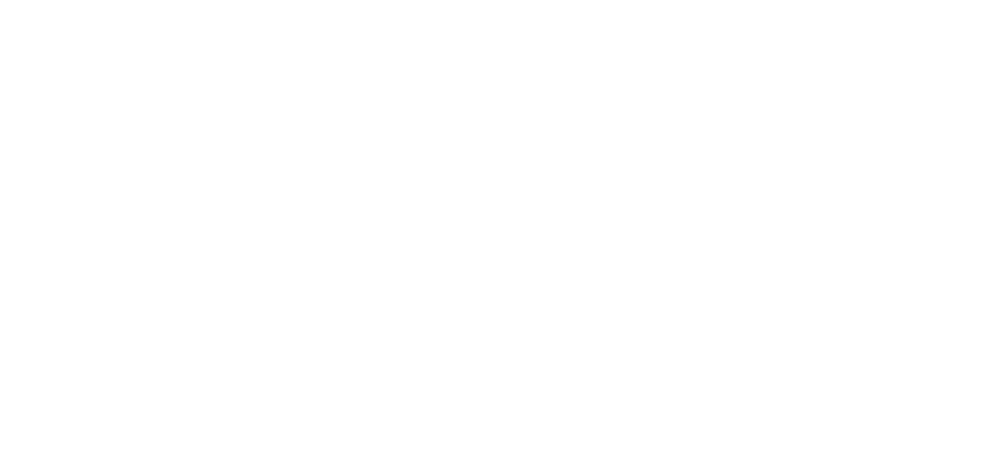

reference:: 9.4

- sei $x_0,x_1,...$ eine abzählbar unendliche Menge an Aussagenvariablen
- Ein *Literal* ist von der Form $x_{i}$ (positiv), $\neg x_{i}$ (negativ)
- Eine *Klausel* C ist eine Disjunktion von Literalen (also $c=\bigvee L_{k}$)
- Eine aussagenlogische Formel in KNF (auch CNF) ist eine Konjunktion von Klauseln
	- $F=\bigvee C_{n}$
	- z.B. $\left(\neg x\lor y\right)\land\left(\neg y\lor z\right)\land\left(x\lor\neg z\right)\land\left(z\lor y\right)$
		- setze x=1,y=1,z=1
-
- Problem: SAT
- Gegeben: eine Formel F in KNF
- Frage: Gibt es eine Belegung $\varphi$ mit $\varphi\left(F\right)=1$
- Variation: k-Sat
	- Änderung: Gegeben: eine Formel in k-KNF
-
- Eine Formel ist in k-KNF, wenn sie in KNF ist und jede Klausel höchstenz k Literale besitzt
-
- Theorem
	- reference:: 9.18
	- 2SAT ist NL-vollständig
	- z.Z.:
		- "Membership": 2SAT$\in$NL
		- "Hardness": 2SAT ist NL-schwer (oder ist coNL-schwer)
-
- Lemma: **2SAT ist in coNL**
	- reference:: 9.19
	- aus $z\lor y:\neg z\Rightarrow y,\neg y\Rightarrow z$
	- aus $\neg y\lor z:y\Rightarrow z,\neg z\Rightarrow\neg y$
	- aus $\neg x\lor y:x\Rightarrow y,\neg y\Rightarrow\neg x$
	- aus $x\lor\neg z:z\Rightarrow x,\neg x\Rightarrow\neg z$
	- {:height 147, :width 307}
	- aber: $F=\left(x\right)=\left(x\lor x\right)$
		- also $\neg x\Rightarrow x$
	- Für eine gegebene 2-KNF F konstruieren wie einen Graph $G_{F}=\left(V_{F},E_{F}\right)$ wie folgt:
		- $V_{F}=\left\lbrace x,\neg x;x\text{ ist eine Variable in F}\right\rbrace$
		- Für jede Klausel $\left(\alpha\lor\beta\right)$ erhalten wir Kanten $\left(\neg\alpha,\beta\right),\left(\neg\beta,\alpha\right)$
		- Für jede Klausel $\left(\alpha\right)$ erhalten wie die Kante $\left(\neg\alpha,\alpha\right)$
		-