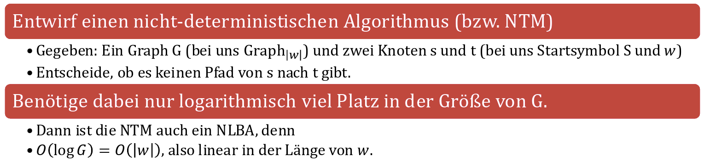

- Der Ableitungsgraph $\text{Graph}_{\left|w\right|}$ zu einer Grammatik $G=\left(N,\Sigma,P,S\right)$ und einem Wort $w\in\Sigma^{\ast}$ hat
	- Als Knotenmenge die Menge der Satzformen der Länge $\leq w$ und
	- Die Kanten sind durch die Ableitungsrelation $\Rightarrow_{G}$ gegeben.
	- Formal: $\text{Graph}_{\left|w\right|}=\left(\left(\Sigma\cup N\right)^{\leq\left|w\right|},\left\lbrace\left(a,b\right):a\Rightarrow_{G}b\right\rbrace\right)$
-
- Es gibt genau dann keine Ableitung $S\Rightarrow_{G}^{\ast}w$, wenn es keinen Pfad von S zu w in $\text{Graph}_{\left|w\right|}$ gibt.
-
- 
-