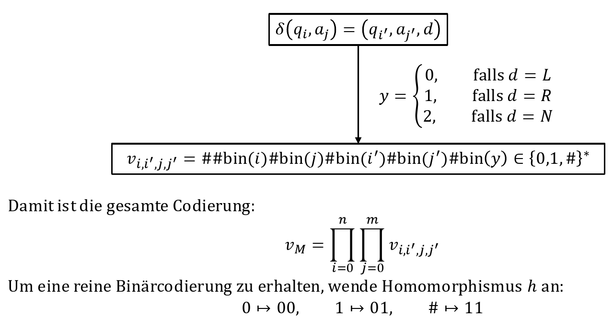

- sei M eine TM und eine Eingabe x
- Frage: Akzeptiert M x? (also $x\in L\left(M\right)$)
-
- Codierung einer TM $M=\left(Q,\Sigma,\Gamma,q_0,\delta,q_{acc},q_{rej}\right)$ mit folgenden Annahmen
	- M ist eine DTM
	- M ist eine 1-Band TM
	- $Q=\left(q_0,q_1,...\right)$ mit
		- Startzustand $q_0$
		- $q_1=q_{acc}$
		- $q_2=q_{rej}$
	- $\Sigma=\left\lbrace0,1\right\rbrace$
	- $\Gamma=\left\lbrace a_0,a_1,a_2,...\right\rbrace$ mit
		- $a_0=\sqcup$
		- $a_1=1$
		- $a_2=0$
- Codierung der Transitionsrelation
	- 
	- zu jeder TM M sei $\langle M\rangle\in\left\lbrace0,1\right\rbrace^{\ast}$ das Wort $h\left(v_{m}\right)$
	- Bei gleicher Codierung von 2 TM's, so ist deren Verhalten gleich
-
- Sei $M_{\varnothing}$ eine TM, die immer nach einem Schritt abweis
	- zu jedem Wort $w\in\left\lbrace0,1\right\rbrace^{\ast}$ wird $M_{W}$ definiert:
		- $$M_{W}\coloneqq \left\lbrace_{M_{\varnothing}\text{ sonst}}^{M\text{ mit }\langle M\rangle=w}\right.$$
-