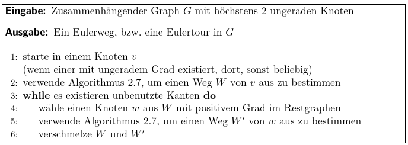
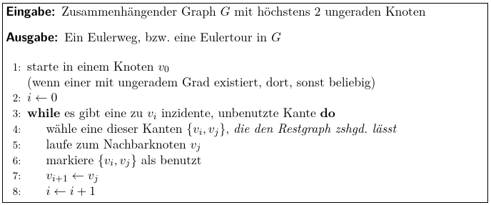
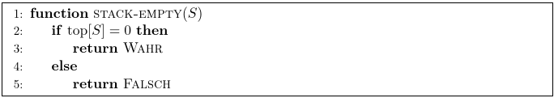
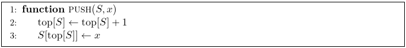
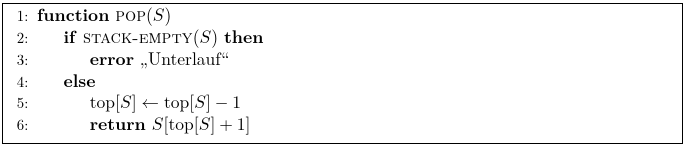
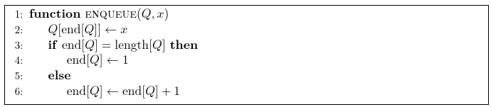
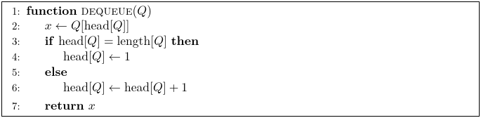

- Ein **Algorithmus** hat die Eigenschaften:
  collapsed:: true
	- **Finitheit**: eindeutige Beschreibbarkeit des Algorithmuses in endlichem Text
	- **Ausführbarkeit**: Jeder Schritt des Algorithmuses muss auführbar sein
	- **Dynamische Finitheit**: Der Algorithmus muss nur endlich viel Speicherplatz benötigen
	- **Terminierung**: Der Algorithmus muss endliche viele Schritte haben
	- Dazu kommen auch
	- **Determinitheit**: Gleiche Eingaben liefern gleiche Ergebnisse
	- **Determinismus**: Alle Schritte sind festgelegt
	- **Randomisierter Algorithmus**: Determinitheit und Determinismus sind nicht bestimmt, es können zufällige Ergebnisse auftreten
-
- **Graphen**
  collapsed:: true
	- Kante ist eine Menge aus zwei Knoten ($e=\left\lbrace v_1,v_2\right\rbrace$)
	  collapsed:: true
		- $v_1,v_2$ können sowohl verschiedene als auch unterschiedliche Knoten sein
		- wenn $v_1=v_2$ dann ist die Kante eine Schleife
	-
	- *adjazente Knoten* (oder auch benachbarte Knoten) sind Knoten, die mit einer Kante verbunden sind
		- $v_1,v_2$ sind beide *inzident* zu e
	- *ungerichteter Graph*
		- $g=\left(V,E,\Psi\right)$
		- V, E endliche Mengen
		  collapsed:: true
			- V = vertices = Knotenmenge
			- E = edges = Kantenmenge
		- $\Psi:E\rightarrow\left\lbrace X\subseteq V|1\leq\left|X\right|\leq2\right\rbrace$
		  collapsed:: true
			- jede Kante enthält ein oder zwei Knoten (Schleife bzw. "gewöhnliche" Kante)
		- *parallele Kanten*: $e=e^{\prime}$ gdw $\Psi\left(e\right)=\Psi\left(e^{\prime}\right)$
		- eine Kante ist eine Schleife, falls $\left|\Psi\left(e\right)\right|=1$
	- *einfacher Graph*
	  collapsed:: true
		- Graph ohne parallele Kanten
		- $G=\left(V,E\right)$ mit $E\left(G\right)$ als Kantenmenge von G
	- *Teilgraph*
	  collapsed:: true
		- $H=\left(V\left(H\right),E\left(H\right)\right)$ ist ein Teilgraph von $G=\left(V\left(G\right),E\left(G\right)\right)$, wenn
		- $V\left(H\right)\subseteq V\left(G\right)$ und $E\left(H\right)\subseteq E\left(G\right)$
		-
		- H ist *aufspannend*, wenn $V\left(H\right)=V\left(G\right)$
	-
	- *Kantenfolge*
		- eine Kantenfolge W aus $G=\left(V,E\right)$ ist $v_1,e_1,v_2,e_2,...,e_{k},v_{k+1}$ mit $k\geq0,e_{i}=\left\lbrace v_{i},v_{i+1}\right\rbrace,v_1...v_{k+1}\in V$
		- **Weg**: Keine Wiederholung einer Kante
			- *geschlossener Weg*: Anfangs- und Endknoten sind gleich
			- *Eulerweg*: geschlossener Weg, welcher alle Knoten besucht
		- **Pfad**: Keine Wiederholung eines Knotens
			- *geschlossener Pfad* / *Kreis*: Anfangs- und Endknoten sind gleich
			- *Hamiltonpfad*: Pfad, welcher alle Knoten besucht
			- *Hamiltonkreis* / *Hamiltontour*: geschlossener Pfad, welcher alle Knoten besucht
		- Wenn ein Weg von $v_1$ nach $v_2$ existiert, dann existiert auch ein Pfad
	-
	- Ein Graph ist **zusammenhängend**, wenn es zwischen je zwei Knoten einen Weg gibt
	- **Grad eines Knotens** ist die Anzahl der inzidenten Kanten, bezeichnet mit $\delta\left(v\right)$
-
- **Eulerwege**
  collapsed:: true
	- Ein Graph $G=\left(V,E\right)$ hat einen Eulerweg, wenn maximal zwei Knoten einen ungeraden Grad haben
	- **Handshake-Lemma**: In jedem Graphen ist die Anzahl der Knoten ungeraden Grades gerade
-
- **Hierholzer Algorithmus für einen Eulerweg** (oder eventuell einer Eulertour)
  collapsed:: true
	- 
	- i.e. finde einen Weg mit beliebig vielen Knoten ($\leq\left|V\left(G\right)\right|$), finde Touren in verbleibenden Knoten und füge diese in den Hauptweg ein
- **Fleury Algorithmus für einen Eulerweg**
  collapsed:: true
	- 
	- Unterschied zu Hierholzer: Es werden keine zufälligen Kanten verwenden, sondern nur Kanten, die den Restgraphen zusammenhängend lassen
-
- **Suche in Graphen**
  collapsed:: true
	- *s-t-Weg*
		- Gegeben: Graph G=(V,E), Startknoten s, Zielknoten t
		- Gesucht: Weg von s nach t (wenn einer existiert)
	- *Zusammenhangskomponente*
		- Gegeben: Graph G=(V,E), Startknoten s
		- Gesucht: alle von s aus erreichbare Knoten -> "Zusammenhangskomponente von s"
-
- **Arten von Graphen**
  collapsed:: true
	- *Wald*: kreisfreier Graph
	- *Baum*: Zusammenhangskomponente in einem Wald (=zusammenhängender kreisfreier Graph)
	- *aufspannender Baum* (auch Spannbaum, spanning tree): Baum, der alle Knoten verbindet
-
- simple Datenstrukturen
	- **Stack**
	  collapsed:: true
		- First in, Last out | Last in, First out
		- Operationen (Pseudocode)
		  collapsed:: true
			- 
			- 
			- 
		- Operationen (basierend auf "Dynamische Datenstrukturen > Kontext")
			- Stack-Empty(S) -> bool
			- Push(S,x)
			- Pop(S) -> x
	- **Queue**
	  collapsed:: true
		- First in, First out
		- Operationen (Pseudocode)
		  collapsed:: true
			- 
			- 
		- Operationen (basierend auf "Dynamische Datenstrukturen > Kontext")
			- Enqueue(Q,x)
			- Deque(Q) -> x
-
- **Tiefensuche** (DFS)
  collapsed:: true
	- Graphenscan mit Stack
	- individuelle Suchstrategie mit lokalen Informationen
- **Breitensuche** (BFS)
  collapsed:: true
	- Graphenscan mit Queue
	- globale Suchstrategie mit globalen Informationen
-
- **Adjazenzmatrizen**
  collapsed:: true
	- Eine Adjazenzmatrix beschreibt welche Knoten miteinander adjazent sind
	- mit $n=\left|V\right|$ ist die Adjazenzmatrix von einem Graphen G=(V,E) immer $n\times n$
	- $A\in\left\lbrace0,1\right\rbrace^{n\times n}$ mit $a_{i,j}=\left\lbrace\frac{1:}{0:}\frac{\left\lbrace v_{i},v_{j}\right\rbrace\in E}{sonst}\right.$
- **Kantenliste**
  collapsed:: true
	- $E=\left\lbrack\left\lbrace v_{a},v_{b}\right\rbrace,...,\left\lbrace v_{x},v_{y}\right\rbrace\right\rbrack$
-
- **Laufzeit von Funktionen**
  collapsed:: true
	- $O$: obere Schranke: maximale Laufzeit
	- $\Omega$: untere Schranke: minimale Laufzeit
	- $\Theta$: asymptotisches Wachstum: generelles Wachstum der Funktion
-
- **Dynamische Datenstrukturen**
	- Verwaltung von einer Menge S Elementen und Ausführung von verschiedenen Operationen
	-
	- Kontext hier:
		- S: Menge von Objekten
		- k ("key"): Wert eines Elementes
		- x,y: Pointer auf ein Element
		- NIL: null-Pointer
		- Funktion(Parameter) -> Rückgabe
		- Search(S,k) -> x | NIL: Suche in S nach k
		- Insert(S,x): Füge x->k in S ein
		- Delete(S,x): Entferne x->k aus S
		- Minimum(S) -> x: min(S)
		- Maximum(S) -> x: max(S)
		- Predecessor(S,x) -> y | NIL: Nächstkleinen Wert bezüglich x in S
		- Successor(S,x) -> y | NIL: Nächstgrößerer Wert bezüglich x in S
	-
	- **Linked Lists**
		- Liste mit Elementen [k, Succ (als x)]
		- Variante [Pred (als x), k, Succ (als y)] = doubly linked list (DLL)
		- DLL kann auch "Wächter" besitzen
			- dann auch zyklische Struktur (Wächter referenziert sich selber)
			- vereinfacht Operationen, da immer ein Wert existiert
		- O(n) von
			- Einfügen: O(1)
			- Suche: O(n)
		- O(n) bei DLL
			- Löschen: O(1)
-
- **Mastertheorem**
	-
-
-
- **Mediane**
	-
-
- **Sortieren**
	-
-