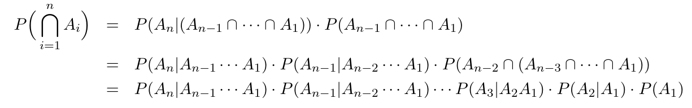

- Sei $\left(\Omega,\mathcal{P}\right)$ ein WR und Ereignisse $A,B\subseteq\Omega:\mathcal{P\left(B\right)>0}$
- Dann heißt $\mathcal{P}\left(A|B\right)=\frac{\mathcal{P}\left(A\cap B\right)}{\mathcal{P}\left(B\right)}$
	- A gegeben B, bzw. A gegeben, dass B
- Beispiel: Laplace-Würfel
  collapsed:: true
	- $A=\left\lbrace2,4,6\right\rbrace,B=\left\lbrace5,6\right\rbrace$, also $A\cup B=\left\lbrace6\right\rbrace$
	- $\mathcal{P}\left(A|B\right)=\frac{\frac16}{\frac26}=\frac12=\text{Laplace}=\frac{\left|A\cap B\right|}{\left|B\right|}$
	- $\mathcal{P}\left(B|A\right)=\frac{\frac16}{\frac36}=\frac13=\frac{\left|B\cap A\right|}{\left|A\right|}$
	- => $\mathcal{P}\left(A|B\right)=\frac{\frac{\left|A\cap B\right|}{\left|\Omega\right|}}{\frac{\left|B\right|}{\left|\Omega\right|}}=\frac{\left|A\cap B\right|}{\left|B\right|}$
-
- Rechenregel für **bedingte Wahrscheinlichkeit**
	- $B\subseteq A\rightarrow\mathcal{P}\left(A|B\right)=1$
	- $A\cap B=\varnothing\rightarrow\mathcal{P}\left(A|B\right)=0$
	- $A_1,A_2:A_{i}\cap A_{j}=\varnothing\rightarrow\mathcal{P}\left(\bigcup_{i=1}^{\infty}A_{i}|B\right)=\sum_{i=1}^{\infty}\mathcal{P}\left(A_{i}|B\right)$
	- $\mathcal{P}\left(\overline{A}|B\right)=1-\mathcal{P}\left(A|B\right)$
	- $\mathcal{P}\left(\bigcap_{i=1}^{\infty}A_{i}\right)>0\rightarrow\mathcal{P}\left(\bigcap_{i=1}^{\infty}A_{i}\right)=P\left(A_{n}|A_{n-1}\cap...\cap A_1\right)=\prod_{i=2}^{n}\mathcal{P\left(A_{i}\right)}$
	- 
-
- **totale Wahrscheinlichkeit**
	- sei $\left(\Omega,P\right)$ WR
	- wobei $B,A_1,...\subseteq\Omega$ mit $A_{i}\cap A_{j}=\varnothing$ paarweise Disjunkt, dann gilt
	- $$B\subseteq\sum_{i}A_{i}\Rightarrow P\left(B\right)=\sum_{i}P\left(B|A_{i}\right)\cdot P\left(A_{i}\right)$$
	- Beweis
		- $$P\left(B\right)=P\left(B\cap\bigcup_{i}A_{i}\right)=P\left(\bigcup_{i}B\cap A_{i}\right)$$
		- $$=P\left(B\cap\sum_{i}A_{i}\right)=P\left(\sum_{i}B\cap A_{i}\right)=\sum_{i}P\left(B\cap A_{i}\right)=\sum_{i}P\left(B|A_{i}\right)\cdot P\left(A_{i}\right)$$
-
- **Formel von Beyes**
	- unter Voraussetzungen der totalen Wahrscheinlichkeit mit $\mathcal{P}\left(B\right)>0$
	- $$P\left(A_{k}\right)>0\Rightarrow P\left(A_{k}|B\right)=\frac{P\left(B|A_{k}\right)\cdot P\left(A_{k}\right)}{\sum_{i}P\left(B|A_{i}\right)\cdot P\left(A_{i}\right)}$$
	- Beweis
		- $$P\left(A_{k}|B\right)=\frac{P\left(A_{k}\cap B\right)}{P\left(B\right)}=\frac{P\left(B\cap A_{k}\right)}{P\left(B\right)}=\frac{P\left(B|A_{k}\right)\cdot P\left(A\right)}{P\left(B\right)}$$
	- Beispiel
		- Diagnostik, Bilderkennung
		- ---
		- A "gesucht", $\overline{A}$ "nicht gesucht", B Identifiziert / Test positiv, $\overline{B}$ nicht Identifiziert
		- gegeben: $P\left(A\right)=\frac{1}{7000},P\left(\overline{A}\right)=1-P\left(A\right)=\frac{6999}{7000}$
		- $$P\left(B|A\right)=0.99$$
		- -> Wk, dass das Gesuchte auch Identifiziert wurde
		- $$P\left(B|\overline{A}\right)=0.005$$
		- -> nicht gesucht, aber erkannt; false positive
		- Gesucht: $P\left(A|B\right)$ (gesucht unter der Wahrscheinlichkeit, dass es indentifiziert wurde ?)