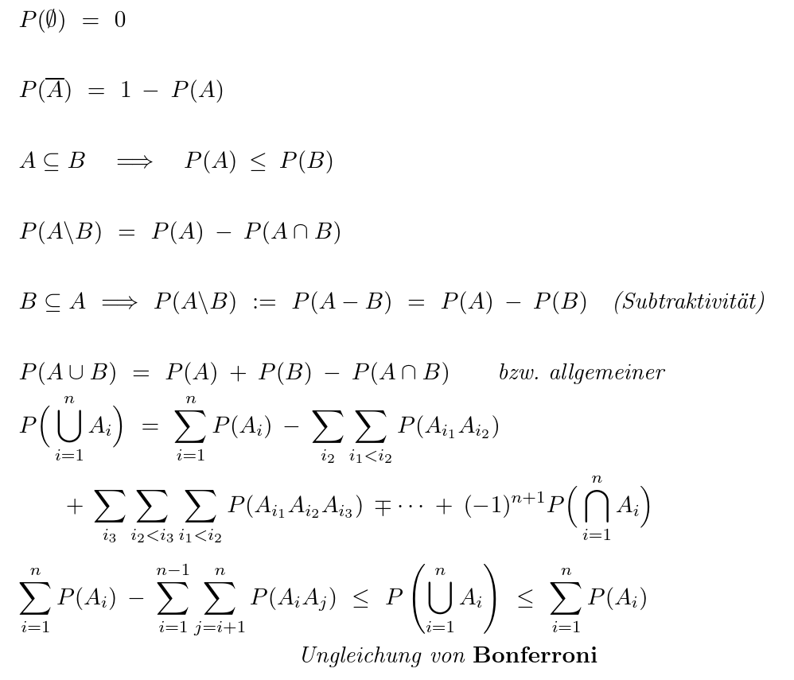

- [[Einführung-in-die-Stochastik-kleine-Übungen]]
-
- Stochastik besteht aus Wahrscheinlichkeit (W-Rechnung) und Statistik (wird nicht behandelt)
-
- Kombinatorische Grundlagen
  collapsed:: true
	- Urnenmodell I:
		- n-Kombinationen ohne Wiederholung
		- n-malige Ziehen aus einer Urne mit N Kugeln ohne Zurückliegen ohne Beachtung der Reihenfolge (o.B.d.R.)
		- (auch: n-maliges belegen von N Fächern mit n Teilchen)
		- $\left(_{n}^{N}\right)=\frac{N!}{n!\left(N-n\right)!}$
		- Bsp: Lotto 6-aus-49
	- Urnenmodell II:
		- n-Variation mit Wiederholung
		- n-malige Ziehen aus einer Urne mit N Kugeln mit Zurückliegen mit Beachtung der Reihenfolge (m.B.d.R.)
		- $N^{n}$
		- Würfeln
-
- Diskrete Wahrscheinlichkeitsräume (diskrete W-Räume)
  collapsed:: true
	- Menge der Versuchsausgängen $\Omega$ (Ergebnisraum)
	  collapsed:: true
		- Würfeln: $\Omega=\left\lbrace1,2,3,4,5,6\right\rbrace$
		- Münzwurf: $\Omega=\left\lbrace0,1\right\rbrace$, wobei 0=Kopf, 1=Zahl
	- Ergebnis: $\omega\in\Omega$ mit $\Omega=\left\lbrace\omega_1,\omega_2,...,\omega_{n}\right\rbrace$
	- **Zufallsexperiment**:
		- unter gleichen Bedingungen
		- beliebig häufig
		- mit vorher bekannten Versuchsausgängen (*VA*)
		- mit unbekannten eintreffenden VA
	- zunächst: $\Omega$ diskret (endlich oder abzählbar unendlich)
	  collapsed:: true
		- abzählbar unendlich: $\Omega=\mathbb{N}_0=\left\lbrace0,1,2,...\right\rbrace$
	- Bsp: Würfeln mit 2 Würfeln:
		- Betrachtung der
		- Paare: $\Omega=\left\lbrace\left(1,1\right),\left(1,2\right),...,\left(6,6\right)\right\rbrace$ mit $\left|\Omega\right|=36$
		- Summe: $\Omega=\left\lbrace2,...,12\right\rbrace$ mit $\left|\Omega\right|=11$
	- Sei $\Omega$ diskret, dann heißt jede $A\subseteq\Omega$ **Ereignis**
	  collapsed:: true
		- $\varnothing$: unmögliches Ereignis
		- $\Omega$: sicheres Ereignis
	- Menge aller Ereignisse, Potenzmenge $\mathcal{P}\left(\Omega\right)=\left\lbrace A\,\vert\,A\subseteq\Omega\right\rbrace$ (Menge aller Teilmengen)
		- Beispiele:
		  collapsed:: true
			- $\Omega=\left\lbrace0,1\right\rbrace$, $\left|\Omega\right|=2$, $\left|\mathcal{P}\left(\mathcal{\Omega}\right)\right|=2^2=4$
			- $\mathcal{P\left(\Omega\right)=\left\lbrace\varnothing,\left\lbrace0\right\rbrace,\left\lbrace1\right\rbrace,\left\lbrace0,1\right\rbrace\right\rbrace=\left\lbrace\varnothing,\left\lbrace0\right\rbrace,\left\lbrace1\right\rbrace,\Omega\right\rbrace}$
			- ---
			- $\Omega=\left\lbrace1,2,3,4,5,6\right\rbrace$, $\left|\Omega\right|=6$, $\left|\mathcal{P}\left(\mathcal{\Omega}\right)\right|=2^6=64$
			- $\mathcal{P\left(\Omega\right)=\left\lbrace\varnothing,\left\lbrace1\right\rbrace,...,\left\lbrace6\right\rbrace,\left\lbrace1,2\right\rbrace,\left\lbrace6,6\right\rbrace\right\rbrace}$
	- Fälle / Begriffe:
		- A tritt ein, wenn ein $\omega\in A$ existiert
			- $\left\lbrace2,4,6\right\rbrace$ tritt ein, wenn ein $\omega=2$ oder $\omega=4$ oder $\omega=6$ eintritt
		- A oder B tritt ein, wenn $A\cup B$ eintritt
			- $\left\lbrace2,4,6\right\rbrace\cup\left\lbrace5,6\right\rbrace=\left\lbrace2,4,5,6\right\rbrace$
		- A und B tritt ein, wenn $A\cap B$ eintritt
			- $\left\lbrace2,4,6\right\rbrace\cap\left\lbrace5,6\right\rbrace=\left\lbrace6\right\rbrace$
		- wenn $A\cap B=\varnothing$, dann heißen A und B disjunkt / unvereinbar
		- Wenn A eintritt, dann tritt auch B ein
			- $A\subseteq B:\left\lbrace1,5\right\rbrace\subseteq\left\lbrace1,3,5\right\rbrace$
		- A tritt ein, aber nicht B
			- $A\backslash B=A\cap\overline{B}$
		- A tritt nicht ein
			- $\overline{A}$ oder auch $A^{c}$, d.h. $=\left\lbrace\omega\in\Omega\,\vert\,\omega\notin A\right\rbrace=\Omega\backslash A$
-
- **Kolmogorov - Axiome**
  collapsed:: true
	- Die Abbildung $\mathcal{P:P\left(\Omega\right)\rightarrow}\left\lbrack0,1\right\rbrack$ mit $\Omega$ disjunkt heißt Wahrscheinlichkeitsmaß (W-Maß) auf $\mathcal{P\left(\Omega\right)}$ (bzw. $\Omega$), falls
		- $\forall A\in\mathcal{P}\left(\Omega\right):\mathcal{P\left(A\right)\geq0}$ ($A\in\mathcal{P\left(\Omega\right)=}A\subset\Omega$)
		- $\mathcal{P\left(\Omega\right)=1}$
		- $\forall A_1,A_2\subseteq\Omega:A_1\cap A_2=\varnothing$ gilt $\mathcal{P\left(\cup_{i\in\mathbb{N}}A\right)}=\sum_{i\in\mathbb{N}}\mathcal{P}\left(A\right)$
			- $=A_1\cup A_2\cup...$ | $=\sum_{i=1}^{\infty}\mathcal{P\left(A_{i}\right)}$
	- $\delta$-Additivität von $\mathcal{P}$
	- Dann heißt $\left(\Omega,\mathcal{P\left(\Omega\right),P}\right)$ ein **diskreter W-Raum** (WR)
	  collapsed:: true
		- Kurzform: $\left(\Omega,\mathcal{P\left(\Omega\right),P}\right)=\left(\Omega,\mathcal{P}\right)$
	- $p_{i}=\mathcal{P}\left\lbrace w_{i}\right\rbrace,i\in\mathbb{N}$
	- // Sei $A=\left\lbrace\omega_1,...,\omega_{r}\right\rbrace$. Dann $\mathcal{P\left(A\right)=P\left\lbrace\omega_1,...,\omega_{r}\right\rbrace}=\mathcal{P}\left(\cup_{i=1}^{r}\left\lbrace\omega_{i}\right\rbrace\right)$
	- 
	- $1=\mathcal{P\left(\Omega\right)=}\sum_{i=1}^{\infty}p_{i}$
	- **Rechenregeln**
	  collapsed:: true
		- {:height 642, :width 740}
		- Inklusions-Exklusions Prinzip aus DiMa trifft auch zu
		  collapsed:: true
			- $\mathcal{P}\left(A_1\cup A_2\cup A_3\right)=+A_1+A_2+A_3-A_1A_2-A_1A_3-A_2A_3+A_1A_2A_3$
-
- [[Laplace-Raum]]
- [[Urnenmodelle]]
- [[Besetzungsmodell]]
-
- [[Bedingte-Wahrscheinlichkeiten]]
- [[Stochastische-Unabhängigkeit]]
-