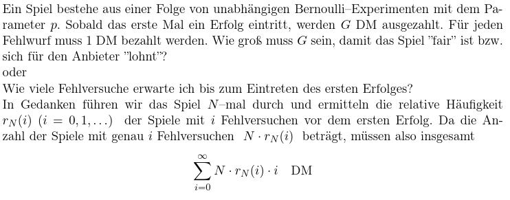
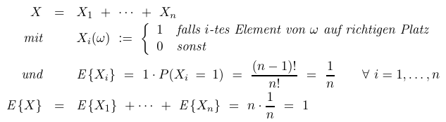

- Bemerkungen
  collapsed:: true
	- [[Bernoulli-Experiment]] mit Parameter p
		- Wie viele Erfolge werden bei n-Maliger Widerholung erwartet?
			- Münze: $p=\frac12\Rightarrow\frac{n}{2}$-Mal
			- Würfel: $p=\frac16\Rightarrow\frac{n}{6}$-Mal
	- [[geometrische-Verteilung]]
		- 
-
- Definition: **Erwartungswert**
	- Sei ZV X auf den WR $\left(\Omega,P\right)$
	- wenn $\sum_{x\in\Omega_{X}}\left|x\right|\cdot P\left(X=x\right)<\infty$ gilt, dann ist $E\left\lbrace X\right\rbrace\coloneqq \sum_{x\in\Omega_{X}}x\cdot P\left(X=x\right)$ der **Erwartungswert** der Zuffalsvariablen X
		- [[absolute-Konvergenz]] wird benötigt, da ansonsten Umordnung der Summanden zu einem anderen Erwartungswert führt
-
- Definition: **bedingter Erwartunsgwert**
	- reference:: 5.5
	- sei ZV X mit existierenden Erwartungswert auf den diskreten WR $\left(\Omega,P\right)$; $A\subseteq\Omega$ ein beliebiges Ereignis (mit $P\left(A\right)>0$)
	- $$E\left\lbrace X|A\right\rbrace\coloneqq \sum_{\omega\in\Omega}X\left(\omega\right)\cdot P\left(\left\lbrace\omega\right\rbrace|A\right)=\sum_{x\in\Omega_{X}}x\cdot P\left(X=x|A\right)$$
	- ist der bedingte Erwartungswert gegeben A
	- Bemerkungen
		- Falls $P\left(A\right)=0$ kann $E\left\lbrace X|A\right\rbrace$ beliebig gewählt werden
		  logseq.order-list-type:: number
		- logseq.order-list-type:: number
		  $$P\left(A\right)>0,\omega\notin A\Rightarrow P\left(\left\lbrace\omega\right\rbrace|A\right)=0$$
	- $$E\left\lbrace X|A\right\rbrace=\sum_{\omega\in A}X\left(\omega\right)\cdot\frac{P\left(\left\lbrace\omega\right\rbrace\right)}{P\left(A\right)}$$
-
- Satz: 5.4
	- $$EX=\sum_{i=1}^{\infty}E\left\lbrace X|A_{i}\right\rbrace\cdot P\left(A_{i}\right)$$
-
- Definition: **unbedingter Erwartungswert**
	- reference:: 5.4
	- sei ZV X mit existierendem Erwartungswert auf WR $\left(\Omega,P\right)$
	- sei $A_1,A_2,...\subseteq\Omega$ eine Folge paarweise disjunkter Ereignisse ($\Omega=\sum_{i}A_{i}$)
	- dann gilt analog die Formel für totale Wahrscheinlichkeit: $E\left\lbrace X\right\rbrace=\sum_{i}E\left\lbrace X|A\right\rbrace\cdot P\left(A_{i}\right)$
-
- Satz: **Existenz des Erwartungswertes**
	- reference:: 5.2
	- Falls $E\left\lbrace X\right\rbrace$ existiert, dann gilt $E\left\lbrace X\right\rbrace=\sum_{\omega\in\Omega}P\left(\left\lbrace\omega\right\rbrace\right)\cdot X\left(\omega\right)$
	- Falls $\sum_{\omega\in\Omega}P\left(\left\lbrace\omega\right\rbrace\right)\cdot\left|X\left(\omega\right)\right|<\infty$ gilt, dann existerit $E\left\lbrace X\right\rbrace$
-
- Satz: **Linearität des Erwartungswertes**
	- reference:: 5.3
	- sei $c\in\mathbb{R}$, X konstante Abbildung nach c
	  logseq.order-list-type:: number
		- => $\forall\omega\in\Omega:X\left(\omega\right)=c$, also $P\left(X=c\right)=1;P\left(X\neq c\right)=0$
		- der Erwartungswert existiert und es gilt $E\left\lbrace X\right\rbrace=c$
	- sei X,Y zwei diskrete ZV auf den gleichen WR; $a,b\in\mathbb{R}$; Erwartungswerte von X,Y existieren
	  logseq.order-list-type:: number
		- $E\left\lbrace a\cdot X+b\cdot Y\right\rbrace=a\cdot E\left\lbrace X\right\rbrace+b\cdot E\left\lbrace Y\right\rbrace$
	- Beweis: Skript
-
- Satz:
	- reference:: 5.5
	- sei ZV X, $f_{X}:\Omega_{X}\rightarrow\mathbb{R}$
	- dann gilt $E\left\lbrace f\left(x\right)\right\rbrace=\sum_{x\in\Omega_{X}}f\left(x\right)P\left(X=x\right)$
-
- Beispiele
  collapsed:: true
	- Ermittlung verschiedener Erwartungswerte
		- $X\sim Bi\left(n,p\right)$
		  logseq.order-list-type:: number
			- $$E\left\lbrace X\right\rbrace=\sum_{i=0}^{n}i\cdot\begin{pmatrix}n\\ i\end{pmatrix}p^{i}\left(1-p\right)^{n-i}=np$$
		- $p\in\left(0,1\right):X\sim Geo\left(p\right)$
		  logseq.order-list-type:: number
			- $$E\left\lbrace X\right\rbrace=\sum_{i=1}^{\infty}i\cdot p\left(1-p\right)^{p}=p\left(1-p\right)\sum_{i=1}^{\infty}i\left(1-p\right)^{i-1}=...=\frac{1}{p}-1$$
	- Sortieren von Listen
		- $\left|\Omega\right|=n!;\Omega=\left\lbrace\omega:\omega\text{ Permutationen von 1,...,n}\right\rbrace=\mathcal{P^{n}}$
		- gegeben: zufällig angeordnete Liste aus n Elementen
		- Maß: Anzahl der Elemente, die auf dem richtigen Platz stehen
		- angenommen [[Laplace-Raum]], also $\forall\omega\in\Omega:P\left(\omega\right)=\frac{1}{n!}$
		- => schwierige Berechnung der Dichte von X
		- 
-
- Definition: **Produkt von zwei Differenzen**
	- reference:: 5.9
	- logseq.order-list-type:: number
	  $$Cov\left(X_1,X_2\right)=E\left(\left(X_1-EX_1\right)\cdot\left(X_2-EX_2\right)\right)$$
		- Cov=covariance=Kovarianz
		- Wenn $Cov\left(X_1,X_2\right)=0$, dann $X_1,X_2$ *unkorreliert*
		- heißt ggf Kovarianz der ZV $X_1$ und $X_2$
		- ---
		- $X=\left(X_1,...\right),x=\left(x_1,...\right):Eg\left(X\right)=\sum_{x\in\Omega_{X}}g\left(x\right)\cdot P\left(X=x\right)$
		- $E\left(X_1,X_2\right)=\sum_{\left(x_1,x_2\right)\in\Omega_{\left(X_1,X_2\right)}}x_1\cdot x_2\cdot P\left(X_1=x_1,X_2=x_2\right)$
	- $X_1$ und $X_2$ heißen *unkorrelierte* ZV, falls $Cov\left(X_1,X_2\right)=0$
	  logseq.order-list-type:: number
		- Bemerkung:
			- Falls $X_1,...,X_{n}$ paarweise unkorreliert sind, dann gilt: $Var\left(\sum_{i=1}^{n}a_{i}X_{i}\right)=\sum_{i=1}^{n}a_{i}^2\cdot Var\left(X_{i}\right)$
			  logseq.order-list-type:: number
				- bei $a_{i}=1:Var\left(\sum_{i=1}^{n}X_{i}\right)=\sum_{i=1}^{n}Var\left(X_{i}\right)$
			- Falls $X_1,...,X_{n}$ vollständig unabhängig sind, sind sie auch paarweise unkorreliert
			  logseq.order-list-type:: number
				- Die Umkehrung gilt nicht
-