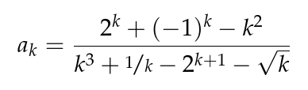

- 
- Wie kann man diese Gleichung auf bekanntes zurückführen?
- leichtere Folge (*): $a_{k}=\frac{\sin k+\left(-1\right)^{k}}{k}$, da Bruch durch k: $\lim_{k\rightarrow\infty}=0$
-
- **Majorantenkriterium für Folgen**
	- Seien $\left(a_{k}\right)\subseteq\mathbb{R},a\in\mathbb{R}$
	- Wenn es eine Nullfolge $\left(\beta_{k}\right)\subseteq\mathbb{R}$ mit $\forall k\in\mathbb{N}:\left|a_{k}-a\right|\leq\left|\beta_{k}\right|$, gibt, dann konvergiert $\lim_{k\rightarrow\infty}a_{k}=a$
	- Im Beispiel (*): $\left|a_{k}-0\right|\leq\frac{2}{k}=:\lim_{k\rightarrow\infty}\beta_{k}=0$
	  collapsed:: true
		- Beweis
		- sei $\epsilon>0$
		- Wegen $\lim_{k\rightarrow\infty}\beta_{k}=0$ gibt es ein $n=n\left(\epsilon\right)\in\mathbb{N}$ mit $\forall k\geq n:\left|\beta_{k}\right|=\left|\beta_{k}-0\right|<\epsilon$
		- für $k\geq n$ gilt damit auch $\left|a_{k}-a\right|\leq\left|\beta_{k}\right|<\epsilon\Rightarrow\lim_{k\rightarrow\infty}a_{k}=a$
	- Beispiel
	  collapsed:: true
		- $\left(a_{k}\right)\subseteq\mathbb{R}:a_{k}=\frac{1}{k^2+k}$
		- $\left|a_{k}-0\right|=\frac{1}{k^2+k}\leq\frac{1}{k}=:\lim_{k\rightarrow\infty}\beta_{k}=0$
		- $\Rightarrow\lim_{k\rightarrow\infty}a_{k}=0$
-
- **Umgekehrte Dreiecksungleichung**
	- $\forall x,y,z\in\mathbb{R:\left|\left|x-z\right|-\left|z-y\right|\right|\leq\left|x-y\right|}$
	- Beweis
	  collapsed:: true
		- $\left|x-z\right|=\left|\left(x-y\right)+\left(y-z\right)\right|=\left|a-b\right|\leq\left|a\right|+\left|b\right|=\left|x-y\right|+\left|y-z\right|=\left|x-y\right|+\left|z-y\right|$
		- => $\left|x-z\right|-\left|z-y\right|\leq\left|x-y\right|$
		- äquivalent: $\left|y-z\right|=-\left|x-z\right|+\left|y-z\right|\leq\left|x-y\right|$
-
- **Folgen der Abstände**
	- Sei $\left(a_{k}\right)\subseteq\mathbb{R}$ eine konvergente Folge mit Grenzwert $a\in\mathbb{R}$
	- dann gilt $\forall b\in\mathbb{R}:\lim_{k\rightarrow\infty}\left|a_{k}-b\right|=\left|a-b\right|$
	- Beweis
	  collapsed:: true
		- $\left|\left|a_{k}-b\right|-\left|a-b\right|\right|\leq\left|a_{k}-a\right|=:\lim_{k\rightarrow\infty}\beta_{k}=0$
-
- **Multiplikation mit Nullfolgen**
	- $\left(x_{k}\right)\subseteq\mathbb{R}$ sei beschränkt
	- $\left(\beta_{k}\right)\subseteq\mathbb{R}$ sei eine Nullfolge
	- dann ist $\left(\beta_{k}\cdot x_{k}\right)$ eine Nullfolge
	- Beweis
	  collapsed:: true
		- sei $r>0$ so, dass $\forall k\in\mathbb{N}:\left|x_{k}\right|\leq r$
		- sei $\epsilon>0$: zZ $\exists n\in\mathbb{N}:\forall k\geq n:\left|\beta_{k}x_{k}-0\right|<\epsilon$
		- => $\left|\beta_{k}x_{k}\right|=\left|\beta_{k}\right|\cdot\left|x_{k}\right|\leq\left|\beta_{k}\right|\cdot r$
		- Ziel: $\left|\beta_{k}\right|\cdot r<\epsilon\Leftrightarrow\left|\beta_{k}\right|<\frac{\epsilon}{r}$
		- Wegen $\lim_{k\rightarrow\infty}\beta_{k}=0$ gibt es $n=n\left(\frac{\epsilon}{r}\right)\in\mathbb{N}$ mit $\forall k\geq n:\left|\beta_{k}\right|<\frac{\epsilon}{r}$
		- => Für $k\geq n$ ist $\left|\beta_{k}x_{k}-0\right|\leq\left|\beta_{k}\right|\cdot r>\frac{\epsilon}{r}\cdot r=\epsilon$
		-
	- Übungen
		- $\left(x_{k}\right),\left(y_{k}\right)\subseteq\mathbb{R}$ mit Grenzwerten $x,z\in\mathbb{R}$
		- $\lim_{k\rightarrow\infty}x_{k}+y_{k}=x+y$
		  collapsed:: true
			- sei $\epsilon>0$
			- zZ: $\exists n\in\mathbb{N}:\forall k\geq n:\left|\left(x_{k}+y_{k}\right)-\left(x+y\right)\right|<\epsilon$
			- $\left|x_{k}+y_{k}-x-y\right|=\left|\left(x_{k}-x\right)+\left(y_{k}-y\right)\right|\leq\left|x_{k}-x\right|+\left|y_{k}-y\right|<\epsilon$
			- es soll also $\left|x_{k}-x\right|<\frac{\epsilon}{2},\left|y_{k}-y\right|<\frac{\epsilon}{2}$
			- -> Da $\lim_{k\rightarrow\infty}x_{k}=x$ gibt es ein $n_{x}\in\mathbb{N}$ mit $\forall k\geq n_{x}:\left|x_{k}-x\right|<\frac{\epsilon}{2}$
				- ebenfalls auch bei $\lim_{k\rightarrow\infty}y_{k}$ (dann Schwellenindex als $n_{k}$)
			- gesuchter Schwellenindex: $n:=\max\left\lbrace n_{x},n_{y}\right\rbrace$
			- => Für $k\geq n:\left|x_{k}+y_{k}-x-y\right|\leq\left|x_{k}-x\right|+\left|y_{k}-y\right|<\frac{\epsilon}{2}+\frac{\epsilon}{2}=\epsilon$
		- $\lim_{k\rightarrow\infty}x_{k}\cdot y_{k}=x\cdot y$
		  collapsed:: true
			- sei $\epsilon>0$
			- zZ: $\exists n\in\mathbb{N}:\forall k\geq n:\left|x_{k}y_{k}-xy\right|<\epsilon$
			- $\left|x_{k}y_{k}-xy\right|=\left|x_{k}y_{k}-x_{k}y+x_{k}y-xy\right|$
			- -> gemeinsame Seitenlängen: $x_{k};y$
			- $=\left|x_{k}\left(y_{k}-y\right)+y\left(x_{k}-x\right)\right|$
			- $\leq\left|x\left(y_{k}-y\right)\right|+\left|y\left(x_{k}-x\right)\right|$
			- $=\left|x_{k}\right|\cdot\left|y_{k}-y\right|+\left|y\right|\cdot\left|x_{k}-x\right|<\epsilon$
			- also $\left\lbrack\frac{\epsilon}{2}\right\rbrack+\left\lbrack\frac{\epsilon}{2}\right\rbrack<\epsilon$
			- da $\lim_{k\rightarrow\infty}x_{k}=0$ gibt zu $\frac{1}{\left|y\right|+1}\frac{\epsilon}{2}>0$ ein Schwellenindex $n_1\in\mathbb{N}$ mit $\forall k\geq n_1:\left|x_{k}-x\right|<\frac{1}{\left|y\right|+1}\frac{\epsilon}{2}\left|y\right|<\frac{\epsilon}{2}$
			- Weil $\lim_{k\rightarrow\infty}x_{k}=x$ ist $\left(x_{k}\right)$ beschränkt
			- => $\exists r>0:\forall k\in\mathbb{N}:\left|x_{k}\right|\leq r$
			- Wegen $\lim_{k\rightarrow\infty}y_{k}=y$ gibt es zu $\frac{\epsilon}{2r}>0$ ein Schwellenindex $n_2\in\mathbb{N}$ mit $\forall k\geq n_2:\left|y_{k}-y\right|<\frac{\epsilon}{2r}$
			- Wähle $n:=\max\left\lbrace n_1,n_2\right\rbrace$ und erhalte für $k\geq n:\left|x_{k}y_{k}-xy\right|\leq\left|x_{k}\right|\left|y_{k}-y\right|+\left|y\right|\left|x_{k}-x\right|$
			- Abschätzung: $<r\cdot\frac{\epsilon}{2r}+\frac{\left|y\right|}{\left|y\right|+1}\frac{\epsilon}{2}<\frac{\epsilon}{2}+\frac{\epsilon}{2}=\epsilon$
		- Es gilt außerdem: $x\neq0:\lim_{k\rightarrow\infty}\frac{1}{x_{k}}=\frac{1}{x}$
		  collapsed:: true
			- sei $\epsilon>0$
			- rechne $\left|\frac{1}{x_{k}}-\frac{1}{x}\right|=\left|\frac{x}{x_{k}x}-\frac{x_{k}}{x_{k}x}\right|$
			- $=\left|\frac{x-x_{k}}{x_{k}x}\right|=\frac{\left|x-x_{k}\right|}{\left|x_{k}x\right|}\leq^{!?}\epsilon$
			- $\Leftrightarrow\left|x-x_{k}\right|<\epsilon\left|x_{k}\right|\left|x\right|$
			- Problem: Wie weit ist $\left|x_{k}\right|$ von 0 entfernt?
			- -> "Sicherheitsabstand" des Glieds $x_{k}$ von 0:
			- Wegen $\lim_{k\rightarrow\infty}x_{k}=x\neq0$ gibt es eine Fehlertoleranz $\frac{\left|x\right|}{2}>0$ ein $n_1\in\mathbb{N}$ mit $\forall k\geq n_1:\left|x_{k}-x\right|<\frac{\left|x\right|}{2}$
			- => $\left|x_{k}\right|>\frac{\left|x\right|}{2}$
			- Wähle $n_2\in\mathbb{N}$ mit $\forall k\geq n_2:\left|x-x_{k}\right|<\epsilon\frac{\left|x\right|^2}{2}$
			- Für $k\geq n:=\max\left\lbrace n_1,n_2\right\rbrace$ gilt: $\left|\frac{1}{x_{k}}-\frac{1}{x}\right|=\frac{\left|x-x_{k}\right|}{\left|xx_{k}\right|}<\frac{\left|x-x_{k}\right|}{\frac{\left|x\right|^2}{2}}<\frac{\epsilon\frac{\left|x\right|^2}{2}}{\frac{\left|x\right|^2}{2}}=\epsilon$
		- $\left(a_{k}\right)=\frac{k^2-1}{\left(2k\right)^2+2k}$
			-
-