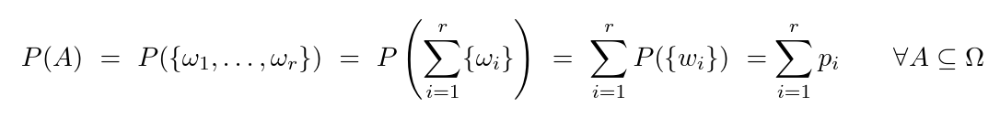

- Die Abbildung $\mathcal{P:P\left(\Omega\right)\rightarrow}\left\lbrack0,1\right\rbrack$ mit $\Omega$ disjunkt heißt Wahrscheinlichkeitsmaß (W-Maß) auf $\mathcal{P\left(\Omega\right)}$ (bzw. $\Omega$), falls
	- $\forall A\in\mathcal{P}\left(\Omega\right):\mathcal{P\left(A\right)\geq0}$ ($A\in\mathcal{P\left(\Omega\right)=}A\subset\Omega$)
	- $\mathcal{P\left(\Omega\right)=1}$
	- $\forall A_1,A_2\subseteq\Omega:A_1\cap A_2=\varnothing$ gilt $\mathcal{P\left(\cup_{i\in\mathbb{N}}A\right)}=\sum_{i\in\mathbb{N}}\mathcal{P}\left(A\right)$
		- $=A_1\cup A_2\cup...$ | $=\sum_{i=1}^{\infty}\mathcal{P\left(A_{i}\right)}$
-
- $\delta$-Additivität von $\mathcal{P}$
- Dann heißt $\left(\Omega,\mathcal{P\left(\Omega\right),P}\right)$ ein **diskreter W-Raum** (WR)
	- Kurzform: $\left(\Omega,\mathcal{P\left(\Omega\right),P}\right)=\left(\Omega,\mathcal{P}\right)$
-
- $p_{i}=\mathcal{P}\left\lbrace w_{i}\right\rbrace,i\in\mathbb{N}$
- // Sei $A=\left\lbrace\omega_1,...,\omega_{r}\right\rbrace$. Dann $\mathcal{P\left(A\right)=P\left\lbrace\omega_1,...,\omega_{r}\right\rbrace}=\mathcal{P}\left(\cup_{i=1}^{r}\left\lbrace\omega_{i}\right\rbrace\right)$
- 
- $1=\mathcal{P\left(\Omega\right)=}\sum_{i=1}^{\infty}p_{i}$
-
- **Rechenregeln**
	- {:height 642, :width 740}
	- Inklusions-Exklusions Prinzip aus DiMa trifft auch zu
	  collapsed:: true
		- $\mathcal{P}\left(A_1\cup A_2\cup A_3\right)=+A_1+A_2+A_3-A_1A_2-A_1A_3-A_2A_3+A_1A_2A_3$
-