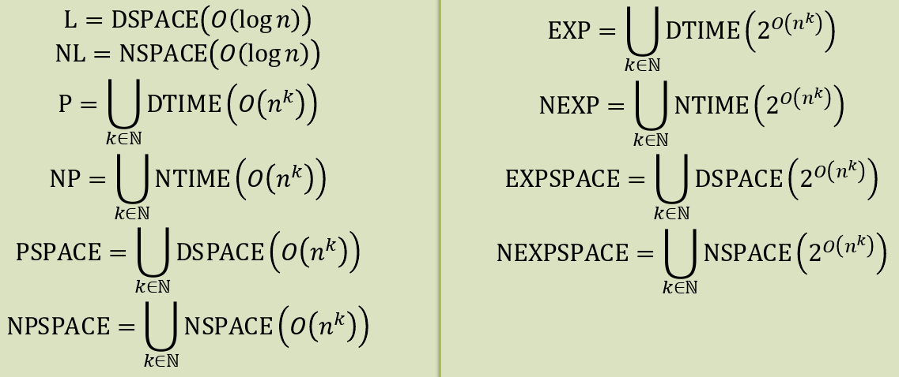

reference:: 7

- [[Landau-Symbole]]
-
- **Komplexitätsklassen**
	- reference:: 7.2
	- *Zeitverbrauch: Time*
		- $\text{Time}_{M}\left(n\right)=\max\left\lbrace\text{Time}_{M}\left(x\right)|x\in\Sigma^{\ast},n=|x|\right\rbrace$
		- Grundelegende Klassen
			- $\text{DTIME}_{m}\left(f\right)=\left\lbrace L\left(M\right)|\text{M ist eine m-Band DTM und f-zeitbschränkt}\right\rbrace$
			- $\text{NTIME}_{m}\left(f\right)=\left\lbrace L\left(M\right)|\text{M ist eine m-Band NTM und f-zeitbschränkt}\right\rbrace$
				- bei 1-Band TM entfällt Index m
	- *Platzverbrauch: Space*
		- sei c eine Konfiguration von M: $\text{Space}_{M}\left(c\right)=\max\left\lbrace|w|,w\text{ ist der Inhalt eines Arbeitsbandes in Konfiguration c}\right\rbrace$
		- Platzverbrauch zu Eingabe x: $\text{Space}_{M}\left(x\right)=\max\left\lbrace\text{Space}_{M}\left(c\right)|c\text{ ist Konfiguration in einer Berechnung von M zu Eingabe}\right\rbrace$
		- Grundlegende Klassen
			- $\text{DSPACE}_{m}\left(f\right)=\left\lbrace L\left(M\right)|\text{M ist DTM mit read‐ only Eingabe, m Arbeitsbändern, ein Entscheider und f-Platzbeschränkt}\right\rbrace$
			- $\text{NSPACE}_{m}\left(f\right)=\left\lbrace L\left(M\right)|\text{M ist NTM mit read‐ only Eingabe, m Arbeitsbändern, ein Entscheider und f-Platzbeschränkt}\right\rbrace$
	- *robuste Komplexitätsklassen*
		- 
-
- Übung:
	- $\mathcal{L}=\left\lbrace w\in\left\lbrace0,1\right\rbrace^{\ast}|w\text{ ist Palindrom}\right\rbrace$
	- Ziel: $\mathcal{L}\in L$
	- -> Band ist Read-Only
	- auch $\mathcal{L}\in P$
	- $\in SPACE_1O\log n$
	- $\in DTIME_1On^2$
	- $\in DTIME_2On$
-
- [[Komplexitätstheorie-Relationen]]
- [[Komplementklasse]]
-
- ---
- Für jede Funktion $\forall n\in\mathbb{N}:f>\log n$ gilt $\text{NSPACE}\left(f\right)=\text{DTIME}\left(2^{O\left(f\right)}\right)$
	- \#Konfiguration
	  logseq.order-list-type:: number
		- Es sei $L\left(M\right)\in\text{NSPACE}\left(f\right)$, wobei M ein f-platzbeschränkter, nicht deterministischer Entscheider mit read-only Eingabe und einem Arbeitsband ist
		- Betrachte eine Eingabe $x\in\Sigma^{\ast}$ der Länge $n=\left|x\right|$
		- \#Konfiguration lässt sich abschätzen durch
			- \#Kopfposition Band 1 * \#Wörter auf Band 2 * \#Kopfposition auf Band 2
			- $=n\cdot\left|\Gamma\right|^{f\left(n\right)}\cdot f\left(n\right)\leq2^{O\left(f\left(n\right)\right)}$
			- einfach, da
				- $f\left(n\right)\geq\log n\Leftrightarrow2^{f\left(n\right)}\geq n$
				- $f\left(n\right)\leq2^{f\left(n\right)}$
				- $\left|\Gamma\right|^{f\left(n\right)}=2^{\log\left|\Gamma\right|\cdot f\left(n\right)}\in2^{O\left(f\left(n\right)\right)}$
					- $\log\left|\Gamma\right|$ ist effektiv Konstante
	- maximale Dauer von NTM M
	  logseq.order-list-type:: number
		- die Platzschranke f induziert Zeitschranke $2^{O\left(f\left(n\right)\right)}$
		- Angenommen dies wäre nicht der Fall und M hat Berechnung $c_0\rightarrow c_1\rightarrow...\rightarrow c_{j}$ mit $j>2^{O\left(f\left(n\right)\right)}$, sodass keine $c_{i}$ Haltekonfiguration ist
		- Da die Anzahl Berechnungen die Anzahl der Konfigurationen übersteigt, muss die Sequenz Wiederholungen beinhalten
		- Es gibt also indizes $i<i^{\prime}$ mit $c_{i}=c_{i}^{\prime}$
		- Durch Wiederholungen des Infixes $c_{i}\rightarrow^{\ast}c_{i^{\prime}}$ konstruieren wir eine nicht haltende Berechnung von M zu Eingabe x
		- => Wiedersrpuch zur Annahme, dass M ein Entscheider ist
		- Damit ist M $2^{O\left(f\right)}$-Zeitbeschränkt
	- Determinisierung
	  logseq.order-list-type:: number
		- Wir haben damit bereits gezeigt:
			- $\text{DSPACE}\left(f\right)\subseteq\text{DTIME}\left(2^{O\left(f\right)}\right)$
			- $\text{NSPACE}\left(f\right)\subseteq\text{NTIME}\left(2^{O\left(f\right)}\right)$
		- Um die gewünschte stärkere Aussage zu zeigen, betrachte den Konfigurationsgraphen von M
		- Der Konfigurationsgraph von M zur Eingabe x ist ein Graph, dessen Knoten die Konfigurationen von M zu x repräsentieren und dessen Kanten berechnungsschritte von M entsprechen
		- Das Resultat ist ein azyklischer (kreisfreier), gerichteter Graph (DAG)
		- Wir konstruieren eine DTM M', die zu einer Eingabe x diesen Graphen konstruiert und ihn nach einer akzeptierenden Berechnung durchsucht
		- Der Graph besitzt nach Abschätzung maximal $2^{O\left(f\left(n\right)\right)}$ viele Knoten, damit kann M' so konstruiert werden, dass der Zeitverbrauch maximal $2^{O\left(f\left(\left|x\right|\right)\right)}$ ist, womit die Aussage folgt
-