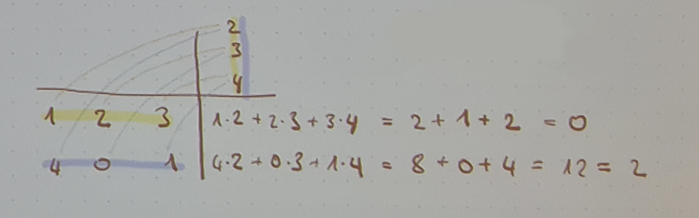
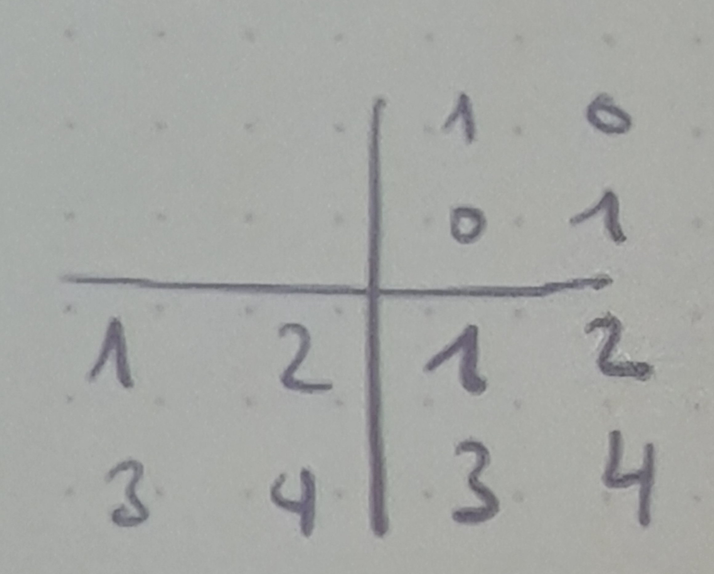
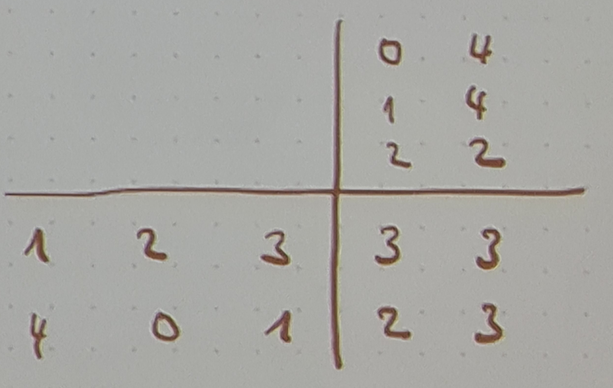

- [[Lineare-Algebra-Übungen]]
-
- Grundlagen:
	- [[Zahlenbereiche]]
	- [[Mengen-mit-Verknüpfung]]
	- [[Äquivalenzrelation]]
	- [[Restklasse]]
	- [[Äquivalenzklasse]]
	- [[Abbildungen]]
	- [[Untergruppe]]
	- [[Ringe]]
	-
	-
	- **Potenzmenge**: $2^{M}$: Menge aller Teilmengen
	- **Kardinalität**: $|M|$: Anzahl der Elemente in $M$
	-
	- **Einheitengruppe**:
		- alle multiplikativ invertierbare Elemente
		- Monoid (M, *) mit neutralen Element $e \in M$
		- $M^x := \{g \in M: \exists \widetilde{g} \in M: g \ast \widetilde{g} = e\}$ Einheitengruppe von M
	-
- Bedeutungen:
	- trivial:
		- ein Fall, der keine Erklärung braucht
-
-
- **Ringe**
	- Konstruktion der rationalen Zahlen
		- $M:=\lbrace(x,y)\in\mathbb{Z^2}:y\neq0\rbrace$ seien durch die Relation $(x,y)\sim(u,v):\Leftrightarrow xv\sim uy$
		- TODO Zeige, dass $\sim$ eine Äquivalenzrelation ist
		  :LOGBOOK:
		  CLOCK: [2024-10-22 Tue 20:13:59]--[2024-10-22 Tue 20:14:00] =>  00:00:01
		  CLOCK: [2024-10-22 Tue 20:14:00]--[2024-10-22 Tue 20:14:01] =>  00:00:01
		  CLOCK: [2024-10-22 Tue 20:14:10]--[2024-10-22 Tue 20:14:11] =>  00:00:01
		  :END:
			- => Unformung $xv=uy\rightarrow\frac{x}{y}=\frac{u}{v}$
			- Reflexivität für $(x,y)\in M$ gilt $x\cdot y=y\cdot x$
				- deswegen gilt $(x,y)\sim(x,y)$
			- Symmentrie
				- $(x,y)\in M$ und $(u,v)\in M$ mit $(x,y)\sim(u,v)$, dann gilt $xv=uy$ also auch $uy=xv$, somit auch $(u,v)\sim(x,y)$
			- Transitivität
				- $(x,y),(u,v),(s,t)\in M$
				- $(x,y)\sim(u,v)$ und $(u,v)\sim(s,t)$ = $xv=uy$ und $ut=sv$
				- $(\ast)$ -> dann $xv=uy$ und $(x,y)\sim(s,t)$
				- zu zeigen ist $(x,y)\sim(s,t),xt=sy$
				- --
				- $(\ast\ast)$ $xv\cdot ut=uy\cdot sv$
					- Fall: $u=0$: aus $(\ast)$ ergibt sich $x=0$ und $s=0$, da v und y nicht 0 sein können (da sie der Nenner sind -> Äquivalenzrelation [Umformung zu Brüchen])
						- Dann ist $xt=0=sy$
					- Fall: $u\neq0$: Nullteilerfreiheit fordert $uv\neq0$
						- $(\ast\ast)$ $uvxt=uvsy$ =[$uv$ kürzen]=> $xt=sy$
				- ==> ist eine Äquivalenzrelation
	- Addition rationaler Zahlen
		- $M,\sim$ wie bei der Konstruktion rationaler Zahlen
		- $\mathbb{Q}:=M/\sim=\lbrace[x,y];x,y\in M\rbrace$ ist die Menge der Äquivalenzklassen bezüglich der Relation
		- Untersuche, durch welche Folgende Ansätze eine Verknüpfung auf den rationalen Zahlen $\mathbb{Q}$ definiert wird
			- a: $[(x,y)]\oplus[(u,v)]:=[(x+u),(y+v)]$ == $\frac{x}{y}\oplus\frac{u}{v}:=\frac{x+u}{y+v}$ => nicht Wahr (so werden nicht Brüche addiert)
				- $\frac12+\frac23=[(1,2)]\oplus[(2,3)]=[(1+2,2+3)]=[(3,5)]$
				  id:: 6716311d-ac39-4f59-a11a-32268d5bcfcd
				- $\frac24+\frac69=[(2,4)]\oplus[(6,9)]=[(2+6,4+9)]=[(8,13)]$
					- $[(3,5)]\neq[(8,13)]$
			- b: $[(x,y)]\#[(u,v)]:=[(xv+uy,yv)]$
				- $\frac{x}{y}\#\frac{u}{v}:=\frac{xv+uy}{yv}$
				- $[(x,y)]=[(x^{\prime},y^{\prime})]$, sodass $xy^{\prime}=x^{\prime}y$ und $[(u,v)]=[(u^{\prime},v^{\prime})]$, sodass $uv^{\prime}=u^{\prime}v$
				- zeige, dass $[(x,y)]\#[(u,v)]=[(x^{\prime},y^{\prime})]\#[(u^{\prime},v^{\prime})]$
					- $(xv+uy,yv)\sim(x^{\prime}v^{\prime}+u^{\prime}y^{\prime},y^{\prime}v^{\prime})$
					- $xvy^{\prime}v^{\prime}+uyy^{\prime}v^{\prime}=x^{\prime}v^{\prime}yv+u^{\prime}y^{\prime}yv$
					- $(\ast)$ $xy^{\prime}vv^{\prime}=x^{\prime}yvv^{\prime}$ => einsetzen in ^, wodurch die Gleichung erfüllt ist
				- ===> # ist eine Verknüpfung auf $\mathbb{Q}$
-
- TODO $(x,y)=[\frac{x}{y}]=\lbrace(u,v);(u,v)\sim(x,y)\rbrace==\frac{x}{y}=\frac{u}{v}==xv=uy==\frac{x}{y}\cdot\frac{u}{v}==\frac{xu}{yu}$
- TODO $\frac{x}{y}+\frac{u}{v}==\frac{xv+uy}{yv}$ repräsentatenunabhängig; $yv\neq0$ -> Nullteilerfreier Ring
- TODO $(x,y)=\frac{x}{y}$
- TODO $M/\sim=M\ mod\sim$
-
- Möchte
  id:: 6718f53b-bba2-44d3-8925-6a5711a304c5
	- $ax=b$ noch x lösen
	- -> $\cdot a^{-1}\rightarrow x=a^{-1}b$
-
- **Körper**
	- $K$ Menge, $+,\cdot$ kommutative Verknüpfungen auf K
	- Dann heißt $K=(K,+,\cdot)$ ein Körper, wenn
		- $(K,+)$ eine abelsche Gruppe ist
		  logseq.order-list-type:: number
			- $e=0=0_{K}$ (0 des Körpers K; auch einfach 0)
		- das Distributivgesetz gilt
		  logseq.order-list-type:: number
			- $a,b,c\in K:a\cdot(b+c)=ab+ac$
		- $(K,\cdot)$ ist ein Monoid, $e=1=1_{K}$
		  logseq.order-list-type:: number
			- mit $K^{\times}=K\setminus\lbrace0\rbrace$ -> $1\neq0$ (inverses Element von 0 existiert nicht, deswegen keine 0)
	- Die Elemente aus K heißen **Skalare** (Wert kann auf Skala abgelesen werden)
	- K ist Nullteilerfrei ($a,b\in K:ab\neq0$)
-
- **Korollar** (Regeln im Körper)
	- sei $K=(K,+,\cdot)$
	- $\forall a,b\in K:$
		- $0\cdot a=0$
		  logseq.order-list-type:: number
		- $a\cdot-1=-a$ (*additiv inverse*)
		  logseq.order-list-type:: number
		- $a,b\neq0\Rightarrow ab\neq0$
		  logseq.order-list-type:: number
		- $(-a)^2=a^2$
		  logseq.order-list-type:: number
	- Beweise:
		- $0\cdot a=(0+0)\cdot a=0\cdot a+0\cdot a$ =[$-(0\cdot a)$]=> $0=0\cdot a$
		  logseq.order-list-type:: number
		- $-1\cdot a[+a]=-1\cdot a+1\cdot a=(-1+1)\cdot a=0$
		  logseq.order-list-type:: number
		- *Konraposition*: Wann ist $ab=0$? -> nur wenn $a=0$ oder $b=0$ (falsche Prämisse)
		  logseq.order-list-type:: number
			- Falls $a\neq0$ gibt es dazu wegen $K^{\times}=K\setminus\lbrace0\rbrace$ ein inverses Element $a^{-1}$ bezüglich der Multiplikation
			- also: $ab=0\Rightarrow a^{-1}ab=a^{-1}\cdot0\Rightarrow b=0$
		- logseq.order-list-type:: number
			- Beispiel: $a=1$: $-1+1=0=[\cdot-1]\Rightarrow(-1)^2+(-1)=0=[+1]\Rightarrow(-1)^2=1=1^2$
			- $(-a)^2=(-1\cdot a)^2=(-1)^2\cdot a^2=a^2$
	- binomische Formeln
		- $2_{K}:=1_{K}+1_{K}$ (zwei im Körper := 1 im Körper + 1 im Körper)
		- dann gelten für $a,b\in K$:
			- $(a+b)^2=a^2+2_{K}ab+b^2$
			  logseq.order-list-type:: number
			- $(a-b)^2=a^2-2_{K}ab+b^2$
			  logseq.order-list-type:: number
			- $(a+b)(a-b)=a^2-b^2$
			  logseq.order-list-type:: number
-
- 1.24: Beispiel
	- $R$ ist Integritätsring (z.B. $R=\mathbb{Z}$)
	- $M=\lbrace(x,y):x\in R,y\in R\setminus\lbrace0\rbrace\rbrace$
	- (1.2) $(x,y)\sim(u,v)\Leftrightarrow xv=uy$ Äquivalenzrelation
	- $Q(R):=M/\sim=\lbrace[(x,y)];(x,y)\in M\rbrace$ ()Menge aller Zahlenpaare, die zueinander Äquivalent sind)
		- Menge der Äquivalenzklassen mit
			- (1.3) $[(x,y)]\oplus[(u,v)]:=[(xv+uy,yv)]$ **!!! uv correct**
			- (1.4) $[(x,y)]\odot[(u,v)]:=[(xu,yv)]$ (auch $\cdot$ bei allen Multiplikationen verwendbar, Erklärung notwendig)
	- ~> $Q(R)$ ist damit ein Körper, der **Quotientenkörper** von R
		- Beispiel: $R=\mathbb{Z}\Rightarrow Q(\mathbb{Z})=\mathbb{Q}$
-
- 1.25: Beispiel
	- $[2]_6\cdot[3]_6=[6]_6=[0]_6$: solange dies nicht der Fall ist, ist K ein Körper
	- Wenn $p\in\mathbb{N}prim$ ist, dann ist $\mathbb{Z}/p\mathbb{Z}=\mathbb{Z_{p}}$ ein Körper mit p Elementen
		- Bezeichnung: $\mathbb{F}_p:=\mathbb{Z}_{p}=\mathbb{Z}/p\mathbb{Z}$ (Körper = Field)
		- **Galais-Körper**
		- Gibt auch $\mathbb{F}_4\neq\mathbb{Z}_4$ (4 kein prim)
-
-
- **Grundbausteine der linearen Algebra**
	- **Tupel**
		- Menge $M$, $n\in\mathbb{Z}$
		- Abbildung $\overrightarrow{x}:\lbrace1,...,n\rbrace\rightarrow M$ ist ein n-Tupel mit der Einträgen aus der Menge M
			- $M^{n}:=M^{\lbrace1,...,n\rbrace}=Map(\lbrace1,...,n\rbrace,M)$
		- $\overrightarrow{x}:\lbrace1,...,n\rbrace\rightarrow M,k\mapsto x_{k}$ (**!!!** $\mapsto$ = Map)
		- $\overrightarrow{x}=(x_{k})_{k=1}^{n}=(x_1,...,x_{n})=$ {horizontales Tupel}
		- 2.2. Addition von Tupeln: $\overrightarrow{x}+\overrightarrow{y}:=(x_{k}+y_{k})_{k=1}^{n}$: => K ist eine abelsche Gruppe ($\overrightarrow{x}+\overrightarrow{y}=(x_{k}+y_{k})_{k=1}^{n}=(y_{k}+x_{k})_{k=1}^{n}=\overrightarrow{y}+\overrightarrow{x}$)
		- neutrales Element: $\overrightarrow{0}=(0,...,0)$
		- inverses Element: $-\overrightarrow{x}=(-x_0,...,-x_{n})$
		- Beispiel
			- $R^2$
			- $\begin{pmatrix}2\\ 3\end{pmatrix}+\begin{pmatrix}1\\ -1\end{pmatrix}=\begin{pmatrix}3\\ 2\end{pmatrix}$
		- *Multiplikation mit Skalaren*
			- K sei ein Körper, $n\in\mathbb{N}$
			- $K\times K^{n}\rightarrow K^{n},(\alpha,\overrightarrow{x})\mapsto\alpha\cdot\overrightarrow{x}:=(\alpha\cdot x_{k})_{k=1}^{n}$
		- 2.4. Rechnen mit Tupeln
			- Körper K, $n\in\mathbb{N}$
			- für alle $\overrightarrow{x},\overrightarrow{y}\in K^{n}$ und alle $\alpha,\beta\in K$ (**Rechengesetze**)
				- $\alpha(\overrightarrow{x}+\overrightarrow{y})=\alpha\overrightarrow{x}+\alpha\overrightarrow{y}$
				  logseq.order-list-type:: number
				- $(\alpha+\beta)\overrightarrow{x}=\alpha\overrightarrow{x}+\beta\overrightarrow{x}$
				  logseq.order-list-type:: number
				- $(\alpha\beta)\overrightarrow{x}=\alpha(\beta\overrightarrow{x})$
				  logseq.order-list-type:: number
				- $1\cdot\overrightarrow{x}=\overrightarrow{x}$
				  logseq.order-list-type:: number
		- **Familie Indexmenge**
			- $(x_{i})_{i\in I}:I\rightarrow K$
			- spezielle I: $I=\lbrace1,...,n\rbrace\times\lbrace1,...,m\rbrace=\lbrace(k,j);k\in\lbrace1,...,n\rbrace,j\in\lbrace1,...,m\rbrace\rbrace$ == Matrix
	- **Matrizen**
		- Familie mit Indexmenge $I=\lbrace1,...,n\rbrace\times\lbrace1,...,m\rbrace$
		- K Körper, $n,m\in\mathbb{N}$
		- $K^{n\times m}=K^{\lbrace1,...,n\rbrace\times\lbrace1,...,m\rbrace}=Map(\lbrace1,...,n\rbrace\times\lbrace1,...,m\rbrace,K)$ = Menge der Abbildungen von {}x{} auf K / Menge der (nxm)-Matrizen mit Einträgen aus K
		- $\underline{a}:\lbrace1,...,n\rbrace\times\lbrace1,...,m\rbrace\rightarrow K$
		- $(k,j)\mapsto a_{kj}$
		- $\underline{a}=[a_{kj}]_{k=1,j=1}^{n,m}=\begin{bmatrix}a_{11} & ... & a_{1m}\\ \vdots &  & \vdots\\ a_{n1} & ... & a_{nm}\end{bmatrix}$
		- 1. Index: Zeile; 2. Index: Spalte
		- Addition ähnlich wie bei Vektoren
			- auf $K^{n\times m}$ wird durch $\underline{a}+\underline{b}:=[a_{kj}+b_{kj}]_{k=1,j=1}^{n,m}$
		- Multiplikation ähnlich wie bei Vektoren
			- $\lambda\in K,\underline{a}\in K^{n\times m}$
			- $\lambda\cdot\underline{a}:=[\lambda\cdot a_{kj}]_{k=1,j=1}^{n,m}$
		- **Transposition**
			- Vertauschen von Zeilen und Spalten (Vertausch der Indezes; Spiegelung an der Diagonalen)
			- $\underline{a}=[a_{jk}]_{j=1,k=1}^{n,m}\in K^{m\times n}$
			- $\underline{a}^{T}=[b_{kj}]_{k=1,j=1}^{n,m}\in K^{n\times m}$ mit $b_{kj}=a_{jk}$
			- b ist die *transponierte Matrix* zu a
			- Beispiel
				- $\underline{a}=\begin{bmatrix}1 & 2 & 3\\ 4 & 5 & 6\end{bmatrix}\in\mathbb{R^{2\times3};}\underline{a}^{T}=\begin{bmatrix}1 & 4\\ 2 & 5\\ 3 & 6\end{bmatrix}\in\mathbb{R^{3\times2}}$
		- **Matrix-Tupel-Multiplikation**
			- Körper K, Matrix $\underline{a}=[a_{kl}]_{k=1,l=1}^{m,n}\in K^{m\times n}$, Vektor $\overrightarrow{x}=(x_{l})_{l=1}^{n}\in K^{n}$
			- $\underline{a}\cdot\overrightarrow{x}:=([_{l=1}^{n}a_{kl}\cdot x_{l})_{k=1}^{m}\in K^{m}$ (Matrix mal Tupel = Tupel)
			- Diese Multiplikation mit einer festen Matrix $\underline{a}$ erzeugt eine Abbildung
			- $A:K^{n}\rightarrow K^{m},A(\overrightarrow{x}):=\underline{a}\cdot\overrightarrow{x}$
			- Es gilt: für alle $A(\alpha\cdot\overrightarrow{x}+\beta\cdot\overrightarrow{y})=\alpha A(\overrightarrow{x})+\beta A(\overrightarrow{y})$
			- **Die Abbildung A ist linear**
			- Beispiel
				- $K=\mathbb{F}_5$
				- $\underline{a}=\begin{bmatrix}1 & 2 & 3\\ 4 & 0 & 1\end{bmatrix},\overrightarrow{x}=\begin{pmatrix}2\\ 3\\ 4\end{pmatrix}$
				- **Falk-Schema**:
				- $\mathbb{F}_5$ beachten!
				- {:height 259, :width 781}
				- $\underline{a}\cdot\overrightarrow{x}=\begin{pmatrix}0\\ 2\end{pmatrix}\in\mathbb{F}_5^2$
		- **Matrix-Matrix-Multiplikation**
			- Körper K
			- $\underline{a}=[a_{kl}]_{k=1,l=1}^{m,n}\in K^{m\times n}$
			- $\underline{b}=[b_{lj}]_{l=1,j=1}^{n,p}\in K^{n\times p}$
				- n ist bei a und b gleich
			- $\underline{a}\cdot\underline{b}:=[[_{l=1}^{n}a_{kl}\cdot b_{lj}]_{k=1,j=1}^{m,p}\in K^{m\times p}$
			- *Spezialfall*: $K^{n\times n}$ ist ein Monoid mit neutralem Element $1|=1|_{n}=[\delta_{kl}]_{k=1,l=1}^{n,n}=\begin{bmatrix}1 & 0 & ... & 0\\ 0 & 1 &  & 0\\ \vdots &  & \ddots & 0\\ 0 & 0 & 0 & 1\end{bmatrix}$
				- **Kronecker-Delta**: $\delta_{kl}=\lbrace\frac{1:k=l}{0:k+l}$
				-
				- {:height 177, :width 194}
			- *Einheitengruppe*
				- $GL(n,K):=(K^{n\times n})^{\times}=\lbrace\underline{a}\in K^{n\times n}\rbrace$, wobei a invertierbar
				- $K=\mathbb{F}_5$
				- {:height 250, :width 381}
		- Identifiziere $\overrightarrow{a}=(a_{j})_{j=1}^{n}\in K^{j}$ mit Matrix $\underline{a}=[\alpha_{jk}]_{j=1,k=1}^{n,1}$ mit $\alpha_{jk}=a_{j}$
		- $\underline{a}=\begin{bmatrix}a_1\\ \vdots\\ a_{n}\end{bmatrix}$ (lax $\overrightarrow{a}=\underline{a}$
		- ${\overrightarrow{a}}^{T}=[a_1,...,a_{n}]$
		-
		- **Permutationsmatrizen**
			- $\sigma\in Perm(n)$, d.h. $\sigma:\lbrace1,...,n\rbrace\rightarrow\lbrace1,...,n\rbrace$ (bijektiv)
			- |k|1|2|3|4|5|
			  |--|--|--|--|--|--|
			  |$\sigma(k)$|5|1|3|2|4|
			- Permutationsmatrix p $\underline{p}:=[\delta_{\sigma(j)k}]_{j=1,k=1}^{n,n}$ (Honecker-Delta)
			- $P_{55}=P_{\sigma(1)5}$
			- $\underline{p}=\begin{bmatrix}0 & 0 & 0 & 0 & 1\\ 1 & 0 & 0 & 0 & 0\\ 0 & 0 & 1 & 0 & 0\\ 0 & 1 & 0 & 0 & 0\\ 0 & 0 & 0 & 1 & 0\end{bmatrix}$
			- $\underline{p}\cdot\overrightarrow{x}=([_{k=1}^{n}\delta_{\sigma(j)k}\cdot x_{k})_{j=1}^{n}=(x_{\sigma(1)},...,x_{\sigma(n)})$
			-
			- $\underline{p}\cdot\underline{a}=[[_{k=1}^{n}\delta_{\sigma(j)}\cdot a_{kl}]_{j=1,l=1}^{n,m}=[a_{\sigma(j)l}]_{j=1,l=1}^{n,m}$
			- => Multiplikation mit der Matrix $\underline{p}$ vertauscht Zeilen von der Matrix $\underline{a}$
			- Insbesondere
				- $\underline{a}=\underline{p}^{T}=[\delta_{\sigma(k)j}]_{j=1,k=1}^{n,m}$
				- $\underline{p}\cdot\underline{p}^{T}=[[_{k=1}^{n}\delta_{\sigma(j)k}\cdot\delta_{\sigma(l)j}]_{j=1,k=1}^{n,n}=[\delta_{jl}]_{j=1,l=1}^{n,n}=1|_{n}$ (*Einheitsmatrix*)
				- => jede Permutationsmatrix ist invertierbar $\underline{p}\in GL(n,K)$, $\underline{p}^{-1}=\underline{p}^{T}$
			- $GL(n,K)$: **generelle Lineare Gruppe** (größte invertierbare Gruppe an Matrizen)
	-
	- $\underline{p}\cdot\underline{p^{}}^{T}=[[_{k=1}^{n}\delta_{\sigma(j)k}\delta_{k\sigma(l)}]_{j=1,l=1}^{n,n}=[\delta_{\sigma(j)\sigma(l)}]_{j=1,l=1}^{n,n}=[\delta_{jl}]_{j=1,l=1}^{n,n}=\underline{1|}_{n}$
		- bijektive Abbildung
		- wenn $\sigma(j)=\sigma(l)$
-
- 2b Reele und komplexe Zahlen
	- Zu $\mathbb{R}$ kommen zu $+,\cdot$ eine Ordnungsrelation < dazu
	- **Ordnungsrelation**
		- eine Relation < auf einer Menge M heißt Ordnungsrelation, wenn
			- $\forall x,y\in M$ gilt genau eine von den Aussagen
				- x < y
				- x = y
				- y < x
			- $\forall x,y,z\in M$ gilt: wenn x < y und y < z, dann x < z (transitivität)
	- **angeordnete Körper**
		- Körper $K=(K,+,\cdot)$, Ordnungsrelation <
		- *verträglichkeit der Rechenoperationen*
			- Addition: $\forall a,b,c\in K:a<b\Rightarrow a+c<b+c$
			- Multiplikation: $\forall a,b\in K:\forall c\in\lbrace t\in\mathbb{R}:t>0\rbrace:a<b\Rightarrow ac<bc$
		- ein solcher Körper $K=(K,+,\cdot,<)$ heißt angeordneter Körper
		- Eigenschaften angeordneter Körper
			- $a,b\in K$ (angeordneter Körper)
			- $a<b\Rightarrow-b<-a$
			- $0<a<b\Rightarrow\frac{1}{b}<\frac{1}{a}$
			- $a\neq0\Rightarrow a^2>0$
			- damit gilt das neutrale Element der Multiplikation $1=1^2>0$
			- und für sein additiv inverses Element $-1<0$
		- in einem angeordneten Körper gibt es kein Element z mit $z^2=-1$
		- Reele Zahlen
			- angeordneter Körper $\mathbb{R}=(\mathbb{R},+,\cdot,<)$ mit der folgenden **Schnitteigenschaft**
				- $A,B\subseteq\mathbb{R}:A\neq\varnothing,B\neq\varnothing:A\cup B=\mathbb{R}$ mit $\forall a\in A:\forall b\in B:a<b$, dann gibt es ein $z\in\mathbb{R}$ mit $a\leq z\leq b$
					- zwei Mengen in $\mathbb{R}$ können durch ein z getrennt werden, $\mathbb{Q}$ nicht
				- Zwei Körper mit dieser Schnitteigenschaft nennt man **isomorph**
					- sie stimmen bis auf die Bezeichnung ihrer Elemente überein
		- Komplexe Zahlen
			- $\mathbb{R^2}$ reelle Paare
			- $(\mathbb{R^2},+)$ mit weiteren inneren Verknüpfungen zu Körper
			- innere Multiplikation
				- $\cdot:\mathbb{R^2}\times\mathbb{R^2}\rightarrow\mathbb{R^2,}\begin{pmatrix}\mathbb{a}\\ \mathbb{b}\end{pmatrix}\mathbb{\cdot\begin{pmatrix}c\\ d\end{pmatrix}:=\begin{pmatrix}ac-bd\\ ad+bc\end{pmatrix}}$
				- $\mathbb{C}:=(\mathbb{R}^2,+,\cdot)$ ist somit ein Körper
			- neutrales Element: $1_{\mathbb{C}}=(1,0)$
			- **imaginäre Einheit** $i:=(0,1),i^2=-1_{\mathbb{C}}$
				- $(a+bi)\cdot(c+di)=ac+bdi^2+bci+adi=[i^2=-1]=(ac-bd)+(bc+ad)i$
					- $\begin{pmatrix}a\\ b\end{pmatrix}\cdot\begin{pmatrix}c\\ d\end{pmatrix}$: erst (oben\*oben-unten\*unten), dann (Kreuzrechnung: oben\*unten+unten\*oben)
					- alle Zahlen in Klammern (am Ende) sind Teil von $\mathbb{R}$
			- Jede Zahl z lässt sich mit $1,i,z\in\mathbb{C}:x,y\in\mathbb{R}:z=x+yi$ darstellen
			- *gaußsche Zahlenebene*
				- x,y Koordinatenebene, nur mit $x=\mathbb{R},y=\mathbb{C}$
				- $\begin{pmatrix}a\\ b\end{pmatrix}=\begin{pmatrix}a\\ 0\end{pmatrix}+\begin{pmatrix}0\\ b\end{pmatrix}=a+bi$
			- Für z=x+yi mit $x,y\in\mathbb{R}$ heißen $Re(x+yi):=x\in\mathbb{R}$ (*Realteil von z*) und $Im(x+yi):=y\in\mathbb{R}$ (*Imaginärteil von z*)
			- Zu $z=(x,y)=x+iy\in\mathbb{C}$ heißt $\overline{z}:=(x,-y)=x-yi$ die zu z *komplex konjugierte Zahl*
				- $Re(z)=\frac12(z+\overline{z})$
				- $Im(z)=\frac{1}{2i}(z-)$