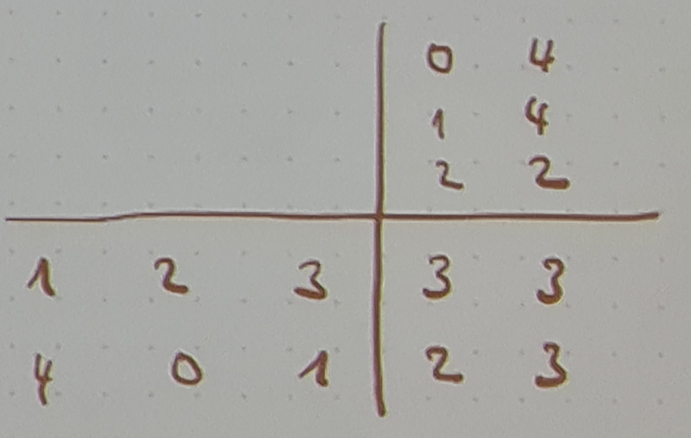

- Familie mit Indexmenge $I=\lbrace1,...,n\rbrace\times\lbrace1,...,m\rbrace$
- K Körper, $n,m\in\mathbb{N}$
- $K^{n\times m}=K^{\lbrace1,...,n\rbrace\times\lbrace1,...,m\rbrace}=Map(\lbrace1,...,n\rbrace\times\lbrace1,...,m\rbrace,K)$ = Menge der Abbildungen von {}x{} auf K / Menge der (nxm)-Matrizen mit Einträgen aus K
- $\underline{a}:\lbrace1,...,n\rbrace\times\lbrace1,...,m\rbrace\rightarrow K$
- $(k,j)\mapsto a_{kj}$
- $\underline{a}=[a_{kj}]_{k=1,j=1}^{n,m}=\begin{bmatrix}a_{11} & ... & a_{1m}\\ \vdots &  & \vdots\\ a_{n1} & ... & a_{nm}\end{bmatrix}$
- 1. Index: Zeile; 2. Index: Spalte
- Addition ähnlich wie bei Vektoren
	- auf $K^{n\times m}$ wird durch $\underline{a}+\underline{b}\coloneqq [a_{kj}+b_{kj}]_{k=1,j=1}^{n,m}$
- Multiplikation ähnlich wie bei Vektoren
	- $\lambda\in K,\underline{a}\in K^{n\times m}$
	- $\lambda\cdot\underline{a}\coloneqq [\lambda\cdot a_{kj}]_{k=1,j=1}^{n,m}$
-
- **Transposition**
	- Vertauschen von Zeilen und Spalten (Vertausch der Indezes; Spiegelung an der Diagonalen)
	- $\underline{a}=[a_{jk}]_{j=1,k=1}^{n,m}\in K^{m\times n}$
	- $\underline{a}^{T}=[b_{kj}]_{k=1,j=1}^{n,m}\in K^{n\times m}$ mit $b_{kj}=a_{jk}$
	- b ist die *transponierte Matrix* zu a
	- Beispiel
		- $\underline{a}=\begin{bmatrix}1 & 2 & 3\\ 4 & 5 & 6\end{bmatrix}\in\mathbb{R^{2\times3};}\underline{a}^{T}=\begin{bmatrix}1 & 4\\ 2 & 5\\ 3 & 6\end{bmatrix}\in\mathbb{R^{3\times2}}$
-
- **Matrix-[[Tupel]]-Multiplikation**
	- Körper K, Matrix $\underline{a}=[a_{kl}]_{k=1,l=1}^{m,n}\in K^{m\times n}$, Vektor $\overrightarrow{x}=(x_{l})_{l=1}^{n}\in K^{n}$
	- $\underline{a}\cdot\overrightarrow{x}\coloneqq ([_{l=1}^{n}a_{kl}\cdot x_{l})_{k=1}^{m}\in K^{m}$ (Matrix mal Tupel = Tupel)
	- Diese Multiplikation mit einer festen Matrix $\underline{a}$ erzeugt eine Abbildung
	- $A:K^{n}\rightarrow K^{m},A(\overrightarrow{x})\coloneqq \underline{a}\cdot\overrightarrow{x}$
	- Es gilt: für alle $A(\alpha\cdot\overrightarrow{x}+\beta\cdot\overrightarrow{y})=\alpha A(\overrightarrow{x})+\beta A(\overrightarrow{y})$
	- **Die Abbildung A ist linear**
	- Beispiel
		- $K=\mathbb{F}_5$
		- $\underline{a}=\begin{bmatrix}1 & 2 & 3\\ 4 & 0 & 1\end{bmatrix},\overrightarrow{x}=\begin{pmatrix}2\\ 3\\ 4\end{pmatrix}$
		- **Falk-Schema**:
		- $\mathbb{F}_5$ beachten!
		- {:height 259, :width 781}
		- $\underline{a}\cdot\overrightarrow{x}=\begin{pmatrix}0\\ 2\end{pmatrix}\in\mathbb{F}_5^2$
-
- **Matrix-Matrix-Multiplikation**
	- Körper K
	- $\underline{a}=[a_{kl}]_{k=1,l=1}^{m,n}\in K^{m\times n}$
	- $\underline{b}=[b_{lj}]_{l=1,j=1}^{n,p}\in K^{n\times p}$
		- n ist bei a und b gleich
	- $\underline{a}\cdot\underline{b}\coloneqq [[_{l=1}^{n}a_{kl}\cdot b_{lj}]_{k=1,j=1}^{m,p}\in K^{m\times p}$
	- *Spezialfall*: $K^{n\times n}$ ist ein Monoid mit neutralem Element $1|=1|_{n}=[\delta_{kl}]_{k=1,l=1}^{n,n}=\begin{bmatrix}1 & 0 & ... & 0\\ 0 & 1 &  & 0\\ \vdots &  & \ddots & 0\\ 0 & 0 & 0 & 1\end{bmatrix}$
		- **Kronecker-Delta**: $\delta_{kl}=\left\lbrace\frac{1:k=l}{0:k+l}\right\rbrace$
		- {:height 177, :width 194}
	- *Einheitengruppe*
		- $GL(n,K)\coloneqq (K^{n\times n})^{\times}=\lbrace\underline{a}\in K^{n\times n}\rbrace$, wobei a invertierbar
		- $K=\mathbb{F}_5$
		- {:height 250, :width 381}
- Identifiziere $\overrightarrow{a}=(a_{j})_{j=1}^{n}\in K^{j}$ mit Matrix $\underline{a}=[\alpha_{jk}]_{j=1,k=1}^{n,1}$ mit $\alpha_{jk}=a_{j}$
- $\underline{a}=\begin{bmatrix}a_1\\ \vdots\\ a_{n}\end{bmatrix}$ (lax $\overrightarrow{a}=\underline{a}$
- ${\overrightarrow{a}}^{T}=[a_1,...,a_{n}]$
-
- **Permutationsmatrizen**
	- $\sigma\in Perm(n)$, d.h. $\sigma:\lbrace1,...,n\rbrace\rightarrow\lbrace1,...,n\rbrace$ (bijektiv)
	- |k|1|2|3|4|5|
	  |--|--|--|--|--|--|
	  |$\sigma(k)$|5|1|3|2|4|
	- Permutationsmatrix p $\underline{p}\coloneqq [\delta_{\sigma(j)k}]_{j=1,k=1}^{n,n}$ (Honecker-Delta)
	- $P_{55}=P_{\sigma(1)5}$
	- $\underline{p}=\begin{bmatrix}0 & 0 & 0 & 0 & 1\\ 1 & 0 & 0 & 0 & 0\\ 0 & 0 & 1 & 0 & 0\\ 0 & 1 & 0 & 0 & 0\\ 0 & 0 & 0 & 1 & 0\end{bmatrix}$
	- $\underline{p}\cdot\overrightarrow{x}=([_{k=1}^{n}\delta_{\sigma(j)k}\cdot x_{k})_{j=1}^{n}=(x_{\sigma(1)},...,x_{\sigma(n)})$
	-
	- $\underline{p}\cdot\underline{a}=[[_{k=1}^{n}\delta_{\sigma(j)}\cdot a_{kl}]_{j=1,l=1}^{n,m}=[a_{\sigma(j)l}]_{j=1,l=1}^{n,m}$
	- => Multiplikation mit der Matrix $\underline{p}$ vertauscht Zeilen von der Matrix $\underline{a}$
	- Insbesondere
		- $\underline{a}=\underline{p}^{T}=[\delta_{\sigma(k)j}]_{j=1,k=1}^{n,m}$
		- $\underline{p}\cdot\underline{p}^{T}=[[_{k=1}^{n}\delta_{\sigma(j)k}\cdot\delta_{\sigma(l)j}]_{j=1,k=1}^{n,n}=[\delta_{jl}]_{j=1,l=1}^{n,n}=1|_{n}$ (*Einheitsmatrix*)
		- => jede Permutationsmatrix ist invertierbar $\underline{p}\in GL(n,K)$, $\underline{p}^{-1}=\underline{p}^{T}$
	- $GL(n,K)$: **generelle Lineare Gruppe** (größte invertierbare Gruppe an Matrizen)
-
- $\underline{p}\cdot\underline{p^{}}^{T}=[[_{k=1}^{n}\delta_{\sigma(j)k}\delta_{k\sigma(l)}]_{j=1,l=1}^{n,n}=[\delta_{\sigma(j)\sigma(l)}]_{j=1,l=1}^{n,n}=[\delta_{jl}]_{j=1,l=1}^{n,n}=\underline{1|}_{n}$
	- bijektive Abbildung
	- wenn $\sigma(j)=\sigma(l)$
-