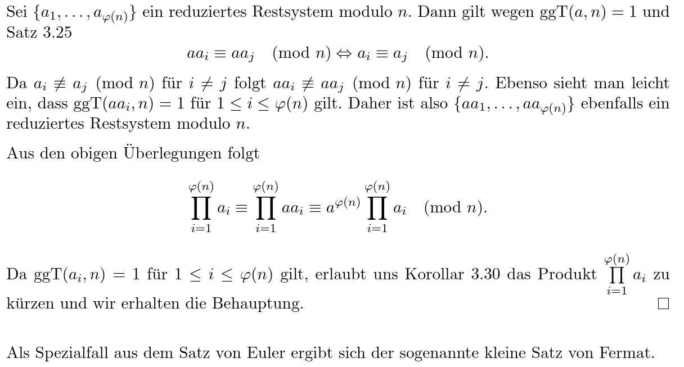
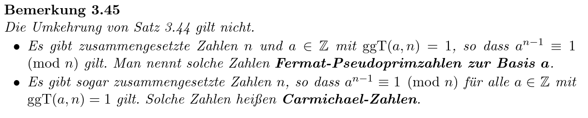

reference:: 3.3

- Seien $a,b\in\mathbb{Z},m\in\mathbb{N}:m\geq2$
- Dann heißt a *kongruent* zu b bmodulo m, falls $m\left|\left(a-b\right)\right.$
	- man schreibt $a\equiv b\left(\bmod\right)$
	- ist a nicht kongruent zu b, dann schreibt man $a\not\equiv b\pmod m$
- $a\equiv b\pmod m\Leftrightarrow m\left|\right.\left(a-b\right)\Leftrightarrow\exists k\in\mathbb{Z}$ mit $a=b+km$
- m nennt man auch *Modulus* der Kongruenz
-
- Für jedes m ist $\equiv$ ein Äquivalenzrelation auf $\mathbb{Z}$ mit genau m Äquivalenzklassen, welche auch Restklassen genannt werden
  collapsed:: true
	- bei m=2
	- wenn $a\equiv b\bmod m\Leftrightarrow$ a und b sind gerade bzw. ungerade
	- wenn $a\not\equiv b\bmod\Leftrightarrow$ ist gerade, b ist ungerade bzw. a ist ungerade, b ist gerade
	- Äquivalenzklassen:
		- $0+2\mathbb{Z}$ = Menge der geraden Zahlen
		- $1+2\mathbb{Z}$ = Menge der ungeraden Zahlen
-
- $\left\lbrace r_1,...,r_{n}\right\rbrace$ heißt vollständiges Restsystem mod m, wenn $r_1\not\equiv r_{j}\pmod m$ für alle $1\leq i,j\leq m,i\neq j$ gilt
	- die Menge enthält aus jeder Äquivalenzklasse mod m genau ein Element
	- Beispiel:
		- m=2
		- $\left\lbrace0,1\right\rbrace$
		- $\left\lbrace-8,7\right\rbrace$
-
- $r\in\mathbb{Z}$ heißt Repräsentant der Restklasse $a+m\mathbb{Z}$ wenn $r\in a+m\mathbb{Z}$
	- $r\equiv a\bmod m$
-
- gilt $r\in\mathbb{Z}m=\left\lbrace0,...,m-1\right\rbrace$, so schreibe $r=a\bmod m$ (r ist der Rest von a mod m)
-
- Seien $a,b,c,d\in\mathbb{Z},m\in\mathbb{N},m\geq2$
	- Es gelte $a\equiv b\bmod m$ und $c\equiv d\bmod m$
	- Dann folgt $a\pm c\equiv b\pm d\bmod m$ und $ac\equiv bd\bmod m$
	- Beweise
		- $a-b=km$ und $c-d=lm$ für gewisse $k,l\in\mathbb{Z}$
		- $\left(a\pm c\right)-\left(b\pm d\right)=\left(a-b\right)\pm\left(c-d\right)=km\pm lm=\left(k\pm l\right)m$
		- mit $k\pm l\in\mathbb{Z}$ gilt $a+c\equiv b+d$
		-
		- $\left(ac-bd\right)=\left(a-b\right)c+b\left(c-d\right)=kmc+blm=m\left(kc+bl\right)$
		- mit $kc+bl\in\mathbb{Z}$ gilt $\left(a-c\right)\equiv b-d$
		-
		- Da $m\geq2$ und $ggT\left(c,m\right)=1$ gilt, ist $c\neq0$
		- Es gilt $ac-bc=km$ für ein $k\in\mathbb{Z}$
		- $\left(a-b\right)c=km$
		- $c\left|lm\right.$
		- $c\left|k\right.$ da $ggT\left(c,m\right)=1$
		- $cd=k$ für ein $d\in\mathbb{Z}$
		- $c\left(a-b\right)=c\left(dm\right)\Leftrightarrow a-b=dm$
		- $a=b\bmod m$
-
- Im Allgemeinen folgt aus $ac\equiv bc\bmod m$ nicht $a\equiv b\bmod m$
-
- **Kongruenzen**
	- Eine Kongruenz der Form $ax\equiv b\bmod m$ mit $a,b,m\in\mathbb{Z},m\geq2$ und einer Variable x heißt *lineare Kongruenz*
	- 3.29:
		- Seien $a,b\in\mathbb{Z},m\in\mathbb{N},m\geq2$
		- Sei $g=ggT\left(a,m\right)$
		- a) $ax\equiv b\bmod m$ lösbar$\Leftrightarrow g\left|b\right.$
		- b) Falls lösbar, so gibt es g verschiedene Lösungen in $\mathbb{Z}_{m}=\left\lbrace0,...,m-1\right\rbrace$
			- ist t eine Lösung, so ist t+m auch eine Lösung
		- Beweise
		  collapsed:: true
			- a)
				- "=>":
					- Sei t eine Lösung: $at=b+km$ für ein $k\in\mathbb{Z}$
					- Da $g\left|a\right.$ und $g\left|m\right.$ folgt $g\left|b=at-km\right.$
				- "<=":
					- Sei $g\left|b\right.$, d.h. $b=b^{\prime}g$ für ein $b^{\prime}\in\mathbb{Z}$
					- Weiter gibt mit 3.15 $g=sa+tm$ für gewisse $s,t\in\mathbb{Z}$
					- -> $b=b^{\prime}g=b^{\prime}\left(sa+tm\right)=a\left(b^{\prime}s\right)+m\left(b^{\prime}t\right)$
					- Dann: $b=\left(b^{\prime}s\right)a\bmod m$
			- b)
				- sei $x_0$ eine Lösung von $ax\equiv b\bmod m$
				- Ist $x_1$ eine weitere Lösung, so folgt
					- $ax_0\equiv b\bmod m$
					- $ax_1\equiv b\bmod m$
					- => $ax_0-ax_1\equiv b-b=0\bmod m$
					- => $a\left(x_0-x_1\right)=km$ für ein $k\in\mathbb{Z}$
					- Seien $a=a^{\prime}g,m=m^{\prime}g$
					- => $a^{\prime}\left(x_0-x_1\right)=km^{\prime}$
					- Da $ggT\left(a^{\prime},m^{\prime}\right)=1$ folgt $m^{\prime}\left|x_0-x_1\right.$
					- => $x_1\equiv x_0\bmod m^{\prime}$
					- Lösungsmenge von $ax=b\bmod m$ ist $x_0,x_0+m^{\prime},x_0+2m^{\prime},...,x_0+\left(g-1\right)m^{\prime}\bmod m$
		- Beispiel:
		  collapsed:: true
			- Finde alle Lösungen von $3x=1\bmod5$ in $\mathbb{Z}_5$
			- Teste, ob eine Lösung existiert
			  logseq.order-list-type:: number
				- $g=ggT\left(a,m\right)=ggT\left(3,5\right)=1$ (normaler euklidischer Algorithmus)
				- $g\left|b\right.$ => Lösung existiert
			- Konstruiere eine Lösung
			  logseq.order-list-type:: number
				- $b=b^{\prime}g$ für $b^{\prime}=1$
				- $g=sa+tm=2\cdot3-1\cdot5$ (erweiterter euklidischer Algorithmus)
				- $x_0=b^{\prime}s=1\cdot2=2$
			- Konstruiere alle Lösungen in $\left\lbrace0,...,4\right\rbrace$
			  logseq.order-list-type:: number
				- existiert genau g=1 Lösung: $x_0$ (3.29)
				- ansonsten mit vielfachen vom $m^{\prime}$ Lösungen finden
-
- Korollar:
	- reference:: 3.30
	- Sei $a\in\mathbb{Z},m\in\mathbb{Z},m\geq2$ mit $ggT\left(a,m\right)=1$
	- Dann existiert genau ein $x_0\in\left\lbrace0,...,m-1\right\rbrace$ mit $ax_0\equiv1\bmod m$
-
- $x_0$ aus 3.30 heißt multiplikatives Inverses von $a\bmod m$
-
- **Chinesischer Restsatz** im Fall teilerfremder Moduli
	- reference:: 3.32
	- Seien $m_1,...,m_{k}\in\mathbb{N},m_{i}\geq2$, paarweise Teilerfremd
	- Seien $a_1,...,a_{k}\in\mathbb{Z}$
	- Betrachte
	- $a_1\equiv x\bmod m_1$
	- $\vdots$
	- $a_{k}\equiv x\bmod m_{k}$
	- Dieses System hat eine eindeutige Lösung in $\mathbb{Z}_{m}$, wobei $m=m_1\cdot\cdot\cdot m_{k}$
	- Beweis
	  collapsed:: true
		- Existenz der Lösung
		  logseq.order-list-type:: number
			- Setze $M_{i}=m/m_{i},1\leq i\leq k\Rightarrow ggT\left(M_{i},m_{i}\right)=1$
			- Es existiert $y\in\mathbb{Z}_{m}$ mit $M_{i}y_{i}\equiv1\bmod m$
			- Bilde $x_0=\sum_{i=1}^{k}a_{i}M_{i}y_{i}$
			- Zeige: $x_0$ ist eine Lösung
			- Dazu: $x_0=a_1M_1y_1+...+a_{i}M_{i}y_{i}+...+a_{k}M_{k}y_{k}\equiv a_{i}M_{i}y_{i}\bmod m\equiv a_{i}\bmod m_{i}\left(1\leq i\leq k\right)$
				- da $M_{i}y_{i}\equiv1\bmod m_{i}$
				- $a_1M_1y_1\rightarrow m_{i}|a_1M_1y_1$
				- $a_{k}M_{k}y_{k}\rightarrow m_{i}|a_{k}M_{k}y_{k}$
			- Bilde $x=x_0\bmod m\in\left\lbrace0,...,m-1\right\rbrace$
			- -> x ist Lösung in $\mathbb{Z}_{m}$
		- Eindeutigkeit
		  logseq.order-list-type:: number
			- Seien $x_0,x_1$ zwei Lösungen
	- Beispiel: 3.33
		- $x\equiv3\bmod4$
		- $x\equiv3\bmod9$
		- $x=1\bmod5$
		- $a_{i}$'s sind 3,3,1
		- $m_{i}$'s sind 4,9,5
		- mod's sind paarweise Teilerfremd -> 3.32 Anwendbar
		-
		- $M_1=m_2m_3=45$
		- $M_2=m_1m_3=20$
		- $M_3=m_1m_2=36$
		-
		- $M_1y_1\equiv1\bmod m_1$
		- $M_2y_2\equiv1\bmod m_2$
		- $M_3y_3\equiv1\bmod m_3$
		-
		- Finde $y_1,y_2,y_3$ mit euklidischen Algorithmus
		- $ggT\left(M_{i},m_{i}\right)=1=s_{i}M_{i}+b_{i}m_{i}$
		-
		- $y_1=1$
		- $y_2=5$
		- $y_3=1$
		-
		- $x_0=\sum_{i=1}^3a_{i}M_{i}y_{i}=3\cdot45\cdot1+3\cdot20\cdot5+1\cdot36\cdot1=471$
		- $471\equiv111\bmod180$
		- 111 ist die eindeutige Lösung in $\mathbb{Z}_{180}$
	- Beispiel: kleine Übung
		- $x\equiv1\bmod3$
		- $x\equiv2\bmod5$
		- $x\equiv3\bmod7$
		- -> Moduli sind paarweise Teilerfremd
		- Lösung:
		- $m=3\cdot7\cdot5=105$
		- $M_1=m/m_1=m_2\cdot m_3=35$
		- $M_2=m/m_2=m_1\cdot m_3=21$
		- $M_3=m/m_3=m_1\cdot m_2=15$
		-
		- $y_1$: Betrachte $M_1\bmod m_1$ als $35\equiv2\bmod3$, also $2\cdot2\equiv1\bmod3$ => $y_1=2$
		- $y_1=M_1\bmod m_2:35\bmod3=2$
		- $y_2=M_2\bmod m_2:21\bmod5=1$
		- $y_3=M_3\bmod m_3:15\bmod7=1$
		- $x_0=a_1M_1y_1+a_2M_2y_2+a_3M_3y_3=1\cdot35\cdot2+2\cdot21\cdot1+3\cdot15\cdot1=157$
		-
		- aber Lösung meist zwischen 0 und m
		- -> $x=x_0\bmod m=157\bmod105=52$
		- x ist die (eindeutige) Lösung des Systems an Kongruenzen in $\left\lbrace0,...,m-1\right\rbrace$
-
- **Eulersche Phi-Funktion**
  collapsed:: true
	- Für $n\in\mathbb{N}$ gilt $\phi\left(n\right)=\left|\lbrace a\in\mathbb{N}\right|a\leq n\space und\space ggT\left(a,n\right)=1\rbrace$
	- Beispiel
	  collapsed:: true
		- n=4: *1*,2,*3* => $\phi\left(4\right)=2$
		- n=12: *1*,2,3,4,*5*,6,*7*,8,9,10,*11* => $\phi\left(12\right)=4$
	- Satz:
		- a: Ist $n=p^{k}$ Primzahlpotenz => $\phi\left(n\right)=\phi^{k-1}\left(p-1\right)$
		- b: Ist $n=a\cdot b$ mit $ggT\left(a,b\right)=1$ => $\phi\left(n\right)=\phi\left(a\right)\cdot\phi\left(b\right)$
		- c: Ist $n=p_1^{l1}\cdot...\cdot p_{r}^{lr}$ für verschiedene Primzahlen $p_1,...,p_{r}$, $l_1>0$
		- => $\phi\left(n\right)=\phi\left(p_1^{l_1}\right)\cdot...\cdot\phi\left(p_{r}^{l_{r}}\right)=\Pi_{l=1}^{r}\phi_{l}^{l-1}\left(p_{i}-1\right)$
			- **NICHT GENUG ZEIT, WAHRSCHEINLICH NICHT RICHTIG**
	- -- Bilder
	- für alle $n\in\mathbb{N}$ gilt $\phi\left(n\right)=n\Pi_{p\in\mathbb{P},p|n}\left(1-\frac{1}{p}\right)$
	-
	- Eine Menge $\left\lbrace a_1,...,a_{\phi\left(n\right)}\right\rbrace$ von $\phi\left(n\right)$ ganze Zahlen heißt **reduziertes Restklassensystem** modulo n, wenn $a_{i}\not\equiv a_{j}\bmod n$ für $1\leq i,j\leq\phi\left(n\right)$ für $i\neq j,ggT\left(a_{i},n\right)=1$
		- Jedes reduziertes Restklassensystem modulo n hat genau $\phi\left(n\right)$ Elemente
	-
	- **Satz von Euler**
		- reference:: 3.43
		- Sei $a\in\mathbb{Z},n\in\mathbb{N}$ mit $ggT\left(a,n\right)=1$, dann gilt $a^{\phi\left(n\right)}\equiv1\bmod n$
		- Beweis
		  collapsed:: true
			- {:height 336, :width 604}
	- **kleiner Satz von Fermat**
		- reference:: 3.44
		- Sei $a\in\mathbb{Z},p\in\mathbb{P}$ mit $p\nmid a$, dann gilt $a^{p-1}\equiv1\bmod p$
		- Bemerkung
		  collapsed:: true
			- {:height 167, :width 771}
-
- Fall beliebiger Moduli auf den Fall teilerfremder Moduli zurückführen
  collapsed:: true
	- $x\equiv a_1\bmod m_1,...,x\equiv a_{k}\bmod m_{k}$
	- mit $m_1,...,m_{k}\in\mathbb{N},m_{i}\geq2$ und $a_1,...,a_{k}\in\mathbb{Z}$
	- Sei $\left\lbrace p_1,...,p_{l}\right\rbrace$ die Menge alle Primteiler von $m_1,...,m_{k}$
	- Schreibe $m_{i}=p_1^{ei,1}\cdot...\cdot p_{l}^{ei,l}$ mit $1\leq i\leq k$ und passenden $e_{i,j}\in\mathbb{N}_0$
	- Lemma 3.34
		- Es gilt $x\equiv a_1\bmod w_{i}$ für $1\leq i\leq k$ genau dann, wenn $x\equiv a_{i}\bmod p_{j}^{ei,j}$ für $1\leq i\leq k,1\leq j\leq l$ gilt
		- Beweis
		  collapsed:: true
			- "=>"
				- klar, denn $p_{j}^{ei,j}|m_{i}$ für $1\leq i\leq k$
			- "<="
				- Ist $x\equiv a_{i}\bmod p_{j}^{ei,j}$ für $1\leq i\leq k,1\leq j\leq l$, so gilt $p_{j}^{ei,j}|\left(x-a_{i}\right)$ für $1\leq i\leq k,1\leq j\leq l$
				- Da $p_1,...,p_{l}$ aber verschiedene Primzahlen sind, folgt nun $m_{i}|\left(x-a_{i}\right)$ für $1\leq i\leq k$
				- somit wie gewünscht $x\equiv a_{i}\bmod m_{i}$ für $1\leq i\leq k$
		- Damit können wir unser System, welches k Kongruenzen umfasst, in l Systeme $\left(\ast_{p1}\right),...,\left(\ast_{pl}\right)$ mit Ebenfalls k Kongruenzen zerlegen
		- -> mehr Systeme, aber einfachere Struktur
-
- Ein System $\left(\ast_{pj}\right)$ **konsistent**, wenn $a_{i}\equiv a_{h}\bmod p_{j}^{\min\left\lbrace e_{i,j},e_{h,j}\right\rbrace}$ für alle $1\leq i,h\leq k,i\neq h$
- Lemma 3.36: Ein System $\left(\ast_{pj}\right)$ ist Lösbar, wenn es konsistent ist
  collapsed:: true
	- Beweis
		- "=>"
			- Ist das System lösbar, dann ist es sicherlich konsistent
		- "<="
			- Sei nun umgekehrt $\left(\ast_{pj}\right)$ konsistent, so wähle s ($1\leq s\leq k$) mit $e_{s,j}=\max\left\lbrace e_{1,j},...,e_{k,j}\right\rbrace$
			- Dann ist $a_{s}$ eine Lösung des Systems, denn sicherlich gilt $a_{s}\equiv a_{s}\bmod p_{j}^{e_{s,j}}$
			- wegen der Konsistenz des Systems gilt auch $a_{s}\equiv a_{i}\bmod p_{j}^{e_{i,j}}$
-
- **Chinesischer Restsatz im Fall beliebiger Moduli**
  collapsed:: true
	- reference:: 3.37
	- Das System $\left(\ast\right)$ ist lösbar, wenn die Systeme $\left(\ast_{p1}\right),...,\left(\ast_{pl}\right)$ lösbar sind.
	- In diesem Fall gibt es eine eindeutige Lösung in $\mathbb{Z}_{m}$, wobei $m=kgV\left(m_1,...,m_{k}\right)$
	- Beweis
	  collapsed:: true
		- "=>"
			- Hat das System eine Lösung, so haben sicherlich auch die Systeme $\left(\ast_{p1}\right),...,\left(\ast_{pl}\right)$ eine Lösung.
		- "<="
			- Seien $\left(\ast_{p1}\right),...,\left(\ast_{pl}\right)$ lösbare Systeme
			- Sei $j\in\left\lbrace1,...,l\right\rbrace$
			- Wähle $1\leq k_{j}\leq k$ so, dass $e_{k_{j},j}=\max\left\lbrace e_{1,j},...,e_{k,j}\right\rbrace$
			- Nach Satz 3.32 hat das folgende System linearer Kongruenzen mit teilerfremden Moduli eine Lösung:
				- $x\equiv a_{k_1}\bmod p_1^{e_{k_1,1}}$
				- $\vdots$
				- $x\equiv a_{k_{l}}\bmod p_1^{e_{k_{l},l}}$
			- Dieses System hat nach 3.32 eine Lösung
	- Beispiel
	  collapsed:: true
		- reference:: 3.38
		-
-