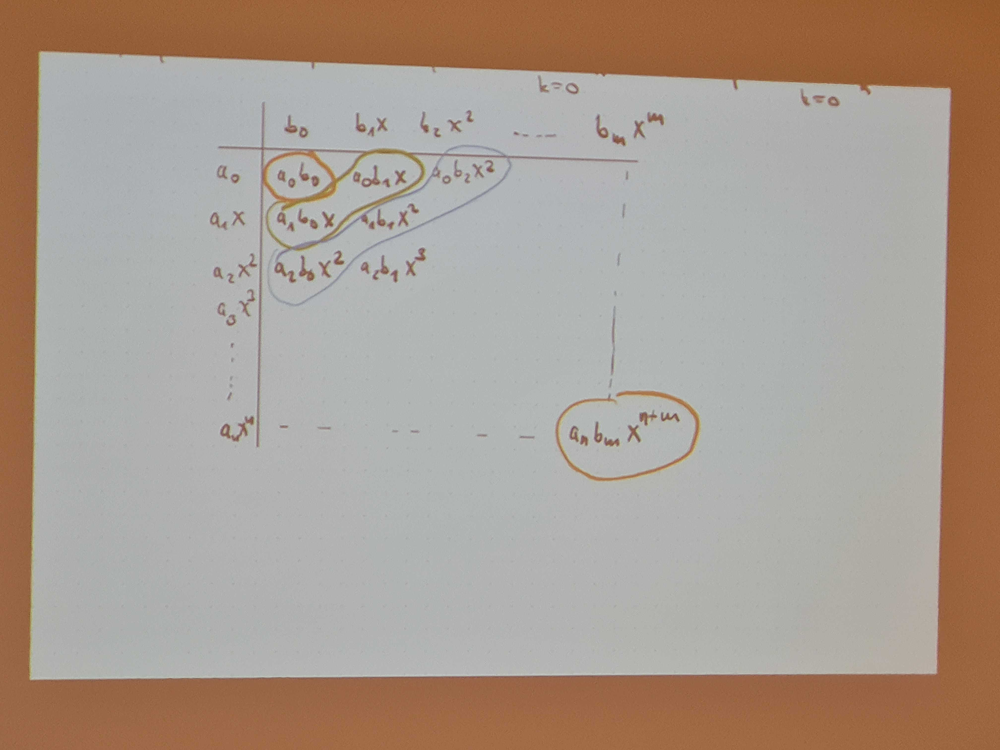
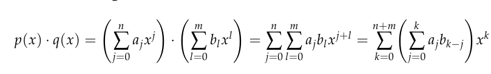

- $(a_{k})_{k=0}^{\infty}=(a_0,...,a_{d},0,...)$
	- für $p=(a_{k})_{k=0}^{\infty}\in Pol_{K}:p\neq0$ heißt der kleinste Index $d\in\mathbb{N_0}$ **Grad von p** (= höchste Potenz)
		- $\deg p:=\min\lbrace d\in\mathbb{N_0},\forall k>d:a_{k}=0\rbrace$
		- $\deg0:=-\infty$
			- Notiz: $-\infty+d:=\infty$
-
- normale Addition zweier Polynome
	- $(a_{k})_{k=0}^{\infty}+(b_{k})_{k=0}^{\infty}=(a_{k}+b_{k})_{k=0}^{\infty}$
- normale Multiplikation mit Skalaren
	- $\alpha\cdot(a_{k})_{k=0}^{\infty}=(\alpha\cdot a_{k})_{k=0}^{\infty}$
-
- $Pol_{K}\leq Map(\mathbb{N_0},K)$
-
- *Multiplikation von Polynomen*
  collapsed:: true
	- Distributivgesetz gilt bei Multiplikation von Polynomen
		- $(x^2+3x-4)\cdot(x^3-x+5)=x^5-x^3+5x^2$ usw
	- {:height 363, :width 468}
	- 
	- $(a_{j})_{j=0}^{\infty},(b_{j})_{j=0}^{\infty}\in Pol_{K}:(a_{j})_{j=0}^{\infty}\cdot(b_{j})_{j=0}^{\infty}:=(\sum_{j=0}^{k}a_{j}b_{k-j})_{k=0}^{\infty}$
		- => $(Pol_{K},+,\cdot)$ ist ein kommutativer, unitärer [[Ring]], sogar Integritätsring
			- Ring ist nullteilerfrei ($p,q\neq0\Rightarrow p\cdot q\neq0$)
-
- **Monome**
	- spezielle Polynome: $X:=(\delta_{k1})_{k=0}^{\infty}=(0,1,0,0,...)$
		- $X^2=(0,0,1,0,0,...)$
	- $\forall l\in\mathbb{N_0}:X^{l}=(\delta_{kl})_{k=0}^{\infty}=(0,...,0,1,0,...)$ (1 an der Stelle l)
		- $X^{j}$ sind Monome
-
- *Einsetzen in Polynome*
  collapsed:: true
	- für $p=\sum_{k=0}^{n}a_{k}X^{k},q\in Pol_{K}$
	- $p(q):=\sum_{k=0}^{n}a_{k}q^{k}$ = Einsetzen von q in p
		- $q^0=1$
	- $\forall p\in Pol_{K}:p=p(X)$ // $q=X\Rightarrow p=p(X)$ (<- nicht im Skript)
	- $K[X]:=Pol_{K}$ ist der Polynomring
-
- Polynomdivision
	- reference:: 4.29
	- Falls $\deg f<\deg g:f=0\cdot g+f$ (r=f)
	- Falls $\deg f\geq\deg g$
		- Reduzieren des Grades von f
		- $f=\sum_{k=0}^{n}a_{k}X^{k},n=\deg f$
		- $g=\sum_{k=0}^{m}b_{k}X^{k},m=\deg g\leq n$
		- $\sum_{k=0}^{n}a_{k}X^{k}=(\sum_{k=0}^{m}b_{k}X^{k})\cdot(\sum_{j=0}^{n-m}c_{j}X^{j})+\sum_{k=0}^{m-1}d_{k}X^{k}$; c und d unbekannt; $m\cdot(m-n)=n$
		- für die Bestimmung von $C_{n-m}$:
			- $\Rightarrow a_{n}X^{n}=b_{m}X^{m}\cdot c_{n-m}X^{n-m}=b_{m}c_{n-m}X^{n}$; an, bm bekannt; bm ist nicht 0
			- => $c_{n-m}=\frac{a_{n}}{b_{m}}$
			- Dadurch $\sum_{k=0}^{n}a_{k}X^{k}=(\sum_{k=0}^{m}b_{k}X^{k})\cdot(\frac{a_{n}}{b_{m}}X^{n-m}+\sum_{j=0}^{n-m-1}c_{j}X^{j})+\sum_{k=0}^{m-1}d_{k}X^{k}$
			- Ausmultiplizieren $\sum_{k=0}^{n}a_{k}X^{k}=(\sum_{k=0}^{m}b_{k}X^{k}\cdot\frac{a_{n}}{b_{m}}X^{n-m})+(\sum_{k=0}^{m}b_{k}X^{k}\cdot\sum_{j=0}^{n-m-1}c_{j}X^{j})+\sum_{k=0}^{m-1}d_{k}X^{k}$
			-