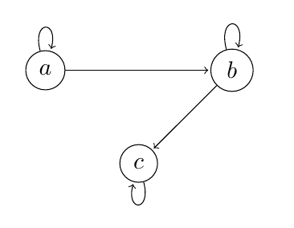

- Eine Teilmenge $R\subseteq A\times B$ heißt (binäre) Relation zwischen A und B (genauer: von A nach B)
	- bei $A=B:R\subseteq A^2$ eine Relation auf A
- Relatonen sind Mengen geordneter Paare
-
- statt $(a,b)\in Z$ schreibt man auch $aZb$ oder $a\sim b$
	- = a steht in Relation mit b
-
- Beispiel: Studierende im Raum
	- A ist die Menge der Studierenden
	- $(a,b)\in R\Leftrightarrow$ a und b studieren das gleiche Fach
	- solch eine Relation leifert eine Einteilung in Klassen
	- $(a,b)\in b\Leftrightarrow$ a ist mit b befreundet
-
- Darstellung von Relationen
	- Pfeildiagram: $a\rightarrow b$ entspricht $(a,b)\in R$
	- *Adjazenzmatrix*: $\begin{pmatrix}a_{11} & ... & a_{1n}\\ \vdots &  & \vdots\\ a_{m1} & ... & a_{mn}\end{pmatrix}$ mit |A|=n und |B|=m
		- $a_{y}=1:(a_{i},b_{j})\in R$ sonst 0
		- Beispiel
			- 
			- $=\begin{pmatrix}1 & 1 & 0\\ 0 & 1 & 1\\ 0 & 0 & 1\end{pmatrix}$
-
- Sei R Relation von A ($R\subseteq A^2$)
	- R ist *reflexiv*, wenn $\forall a\in A:(a,a)\in R$
	- R ist *symmetrisch*, wenn $(a,b)\in R$ und $(b,a)\in R$
	- R ist *transitiv*, wenn $(a,b),(c,d)\in R$, aber auch $(c,d)\in R$ gilt
	- R ist *antisymmetrisch*, wenn $(a,b),(b,a)\in R$ folgt a=b
	- R ist *linear*, wenn $\forall a,b\in A$ gilt: $(a,b)\in R$ oder $(b,a)\in R$ oder a=b
-
- *n-Stellige Relationen*
	- $R\subseteq\times_{i=1}^{n}A_{i}$