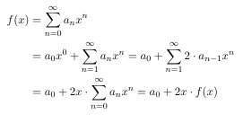

- **Erzeugende Funktionen**
	- betrachte Zahlenfolge wie
	- $\left(a_{n}\right)_{n\in\mathbb{N}}:1,2,4,8,16,...$
	- $\left(b_{n}\right)_{n\in\mathbb{N}}:1,1,2,3,5,8,13,...$
	- Sei $\left(a_{n}\right)_{n\in\mathbb{N}}$ eine Zahlenfolge mit $a_{n}\in\mathbb{R}$
	- Dann heißt $f\left(x\right)=\sum_{n=0}^{\infty}a_{n}x^{n}$ die *gewöhnliche Funktion* von $\left(a_{n}\right)_{n\in\mathbb{N}}$
	- Beispiel
		- $a_{n}=2a_{n}-1,n=0,1,2,...$
		- $a_0=1$
		- mit $a_1=2,a_2=4,a_3=8,...$
		- dann $f(x)=1x^0+2x^1+4x^2+8x^3+...$
		- "geschlossene Form" (expliziete Formel für $a_{n}$) gesucht
		- 
		-