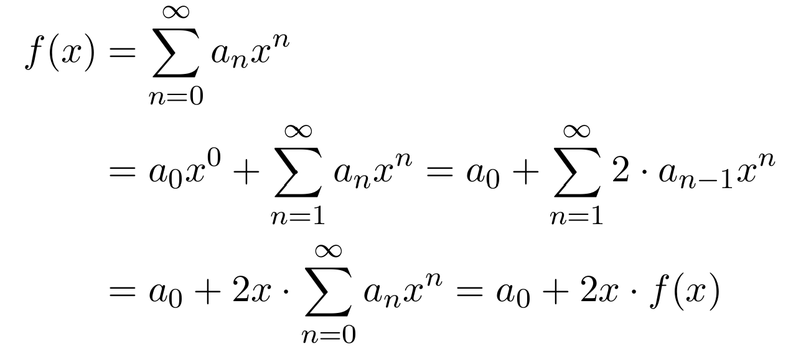
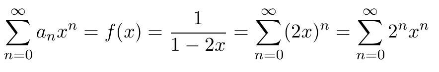

- **Erzeugende Funktionen**
	- reference:: 5.8
	- betrachte Zahlenfolge wie
	- $\left(a_{n}\right)_{n\in\mathbb{N}}:1,2,4,8,16,...$
	- $\left(b_{n}\right)_{n\in\mathbb{N}}:1,1,2,3,5,8,13,...$
	- Sei $\left(a_{n}\right)_{n\in\mathbb{N}}$ eine Zahlenfolge mit $a_{n}\in\mathbb{R}$
	- Dann heißt $f\left(x\right)=\sum_{n=0}^{\infty}a_{n}x^{n}$ die *gewöhnliche Funktion* von $\left(a_{n}\right)_{n\in\mathbb{N}}$
	- Beispiel $\left(a_{n}\right)_{n\in\mathbb{N}}$
	  collapsed:: true
		- $a_{n}=2a_{n}-1,n=0,1,2,...$
		- $a_0=1$
		- mit $a_1=2,a_2=4,a_3=8,...$
		- dann $f(x)=1x^0+2x^1+4x^2+8x^3+...$
		- "geschlossene Form" (expliziete Formel für $a_{n}$) gesucht
		- {:height 174, :width 376}
		- nach f(x) auflösen: $f\left(x\right)=1+2x\cdot f\left(x\right)\Leftrightarrow f\left(x\right)\cdot\left(1-2x\right)=1$
		- also $f\left(x\right)\frac{1}{1-2x}$
		- Nutzung von $\sum_{n=0}^{\infty}p^{n}=\frac{1}{1-p}$ um in geometrische Reihe zu schreiben: {:height 119, :width 637}
		- Damit die Gleicheit gilt, müssen die Koeffizienten gleich sein:
			- $a_0=2^0$
			- ...
			- $a_{n}=2^{n}$
	-