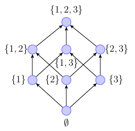
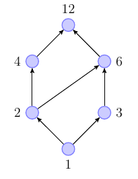

- Syntax und Semantik von Programmiersprachen
- Automaten und formale Sprachen
-
- [code1] || [code2] = paralleler Code
- DRF-Guarantee (Data Race Free Guarantee)
	- Wenn das Programm ohne synchronisierten Zugriff ist, dann ist der shared memory wie sequenzieller Speicher
-
- **Verband**
	- partielle Ordnung, bei der für jedes Paar $a,b\in D$ ein Join ($a\sqcup b$) und ein Meet ($a\sqcap b$) existieren
	- **vollständiger Verband**
		- jede Teilmenge $X\subseteq D$ von Elementen Join $\sqcup X$ und Meet $\sqcap X$ existieren
		- unendliche Ordnungen
-
- *Unvergleichbarkeit*
  collapsed:: true
	- Beispiel: Teilmengen von $\lbrace0,1,2,3\rbrace$
		- 
		- $\lbrace1\rbrace$ und $\lbrace3\rbrace$ sind unvergleichbar
	- Beispiel: Teiler von 12
		- "->" entspricht "teilt"
		- 
		- 2 und 3 sind unvergleichbar
-
- **partielle Ordnung**
  collapsed:: true
	- $(D,\leq):D\neq\varnothing$ und eine Relation $\leq\subseteq D\times D$
		- **reflexiv**: $x\in D:x\leq x$: jeder Knoten ist größer gleich sich selber ("hat Schleife")
		- **transitiv**: $x,y,z\in D:x\leq y,y\leq z\Rightarrow x\leq z$: Zusammenfassung von Gleichungen ("Abkürzungen")
		- **anti-symmetrisch**: $x,y\in D$: Wenn $x\leq y$ und $x\geq y$, dann $x=y$
	- Zeichnen vonpartiellen Ordnugnen als **Hasse-Diagram**
		- keine reflexiven Verbindungen
		- keine transitiven Verbindungen
-
- **binäre Relationen**
  collapsed:: true
	- Erfassung als gerichtete Graphen möglich
		- Beispiel:
			- $a,b,c,d\in D:\lbrace(a,a),(a,b),(b,c),(b,d),(d,c)\rbrace$
-
- Meet und Join
	- **Join**
		- $(D,\leq)$ (partielle Ordnung); $X\subseteq D$
		- ein Element $o\in D$ heißt **obere Schranke** der Menge D, falls $\forall x\in D:x\leq o$ (Join von $X\leq D$)
		- $o\leq o^{\prime}$ für alle obere Schranken von X
		- Join X = $\sqcup X$
	- **Meet**
		- $(D,\leq)$ (partielle Ordnung)
		- $u=\sqcap X$ für die größte obere Schranke
	- Meet und Join immer implizit in jeder partiellen Ordnung
	- Beispiel:
		- $a,b,c,d\in D$: $a\rightarrow c,d;b\rightarrow c,d$
		- c und d sind obere Schranken
	- **Verband**
		- partielle Ordnung mit mehr Struktur
		- $a,b\in D$: $a\sqcup b$ und $a\sqcap b$ existieren
			- $a\sqcup b\Leftrightarrow\sqcup\lbrace a,b\rbrace$ und $a\sqcap b\Leftrightarrow\sqcap\lbrace a,b\rbrace$
		- **vollständiger Verband**
			- $\forall x\leq D$ besitzen einen Join und Meet
		- Beispiele
			- $a\ b$: kein Verband
			- $(\mathbb{N},\leq)$: Verbund (nicht vollständig)
-
- **Lemma**
	- jeder endliche Verband $(D,\leq)$ ist bereits vollständig
	  logseq.order-list-type:: number
	- jeder vollständige Verband $(D,\leq)$ hat ein eindeutig kleinstes Element $\bot:=\sqcup\varnothing=\sqcap D$ und ein eindeutig größtes Element $\top:=\sqcap\varnothing=\sqcup D$
	  logseq.order-list-type:: number
-
- **monotone Funktionen**
	- $(D,\leq)$ (partielle Ordnung)
	- $f:D\rightarrow D$ ist monoton, wenn $\forall x,y\in D:x\leq y:f(x)\leq f(y)$
- **Fixpunkte**
	- $(D,\leq)$ (partielle Ordnung)
	- $f:D\rightarrow D$ monotone Funktion
	- Ein Fixpunkt ist ein $x\in D$, bei dem $f(x)=x$
	- $Fix(f)=\lbrace x\in D:f(x)=x\rbrace$ ist die Menge aller Fixpunkte von f in D
	- **Pre-Fixpunkt**
		- $x\in D:f(x)\leq x$
		- $Prefix(f)$: Menge aller Pre-Fixpunkte von f in D
	- **Post-Fixpunkt**
		- $x\in D:f(x)\geq x$
		- $Postfix(f)$: Menge aller Post-Fixpunkte von f auf D
-
- **Satz**
	- $(D,\leq)$ (partieller Verbund)
	- $f:D\rightarrow D$ monoton
	- $\sqcap Prefix(f)$ ist der eindeutig kleinster Fixpunkt von f
	  logseq.order-list-type:: number
		- $kfp(f)$ oder auch $\mu f$
	- $\sqcup Postfix(f)$ ist der eindeitig größter Fixpunkt von f
	  logseq.order-list-type:: number
		- $gfp(f)$ oder auch $\nu f$