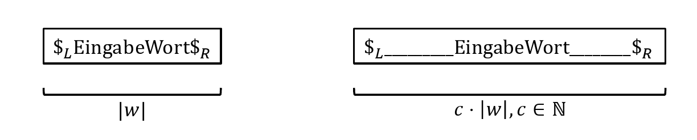
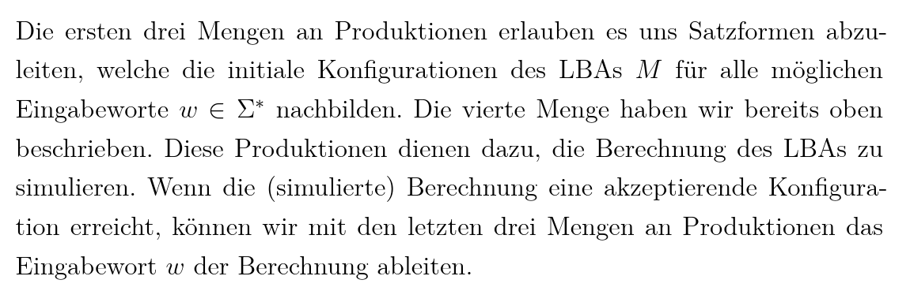

- Eine TM M ist ein Tupel $M=\left(Q,\Sigma,\Gamma,\sqcup,q_0,\delta,Q_{F}\right)$
  collapsed:: true
	- Q: Menge an Kontrollzuständen
		- $q_0\in Q$: Startzustand
		- $Q_{F}\subseteq Q$: Endzustände
	- $\Sigma\neq\varnothing$: Eingabealphabet
	- $\Gamma\neq\varnothing$: Bandalphabet
		- $\Sigma\subset\Gamma$
		- $\sqcup$ "Blank"-Symbol / Leerzeichen
		- $\sqcup\notin\Sigma$
	- **deterministische Turing Maschine** (DTM)
		- $\delta:Q\times\Gamma\rightarrow Q\times\Gamma\times\left\lbrace L,R,N\right\rbrace$ (Links, Rechts, Neutral)
	- **nichtdeterministische Turing Maschine** (NTM)
		- $\delta\subseteq Q\times\Gamma\times Q\times\Gamma\times\left\lbrace L,R,N\right\rbrace$
-
- **Konfiguration**
  collapsed:: true
	- sei $M=\left(Q,\Sigma,\Gamma,\sqcup,q_0,\delta,Q_{F}\right)$ eine TM
	- Eine Konfiguration von M ist ein Tripel $uqv\in\Gamma^{\ast}\times Q\times\Gamma^{\ast}$
		- u ist der Bandinhalt links vom Schreibkopf
		- q ist der aktuelle Kontrollzustand
		- v ist der Bandinhalt rechts vom Schreibkopf
	- Die Startkonfiguration von M für die EIngabe $w\in\Sigma^{\ast}$ ist die Konfiguration $q_0w$
		- für $w=\epsilon$ ist die Startkonfiguration $q_0\sqcup$
	- $\delta$ induziert eine *Transitionsrelation* zwischen Konfigurationen
	  collapsed:: true
		- 
		-
	- eine Konfiguration uqv heißt *akzeptierend*, wenn $uqv\in\Gamma^{\ast}\times Q_{F}\times\Gamma^{\ast}$
	- eine Berechnung von M auf Eingabe $w\in\Sigma^{\ast}$ ist die unendliche Sequenz von Konfigurationen $c_0=q_0q\rightarrow c_1\rightarrow c_2\rightarrow...$ die sich von der Startkonfiguration zu w aus ergibt
		- in einer DTM sind die Nachfolger einer Konfiguration immer eindeutig
		- oft ist nur der endliche Präfix $c_0\rightarrow^{\ast}c_{k}$ relevant
	- Die Sprache $L\left(M\right)=\left\lbrace w\in\Sigma^{\ast}\,\vert\text{M akzeptiert w}\,\right\rbrace=\left\lbrace w\in\Sigma^{\ast}\,\vert\,jq_0w\rightarrow^{\ast}uq^{\prime}v\in\Gamma^{\ast}Q\Gamma^{\ast}\right\rbrace$
-
- Varianten
  collapsed:: true
	- *Mehrband-TM*
		- sei $k\in\mathbb{N}$
		- k-Band-TM sind analog zu TM definiert, besitzen aber k Bänder mit einem Kopf pro Band
		- damit gilt für die Transitionsfunktionen:
			- Deterministische k-Band-TM: $\delta:Q\times\Gamma^{k}\rightarrow Q\times\Gamma^{k}\times\left\lbrace L,R,N\right\rbrace^{k}$
			- Nichtdeterministische k-Band-TM: $\delta:Q\times\Gamma^{k}\rightarrow\mathcal{P}\left(Q\times\Gamma^{k}\times\left\lbrace L,R,N\right\rbrace^{k}\right)$
		- In der Initialkonfiguration sind alle Bänder außer dem ersten Leer
		- Zu jeder k-Band-TM $M_{k}$ existiert eine TM $M$, die $M_{k}$ effizient simuliert
			- es gilt $L\left(M_{k}\right)=L\left(M\right)$
			- wenn $M_{k}$ deterministisch ist, dann ist $M$ deterministisch
			- Beweis
			  collapsed:: true
				- M simuliert einen Schritt von $M_{k}$ durch eine Sequenz von Schritten
				- Idee: Speichere den Inhalt der k-Bänder von $M_{k}$ in einem einzigen Band
				- k-Bänder werden zu einem "breiten" Band vereinigt
				- Dieses Band ist in 2k Spuren aufgeteilt
				  collapsed:: true
					- Die (2l-1)-ste Komponente eines Buchstabens in $\Gamma^{\prime}$ speichert den Inhalt des l-ten Band.
					- Die (2l)-ste Komponente, welche ein Element aus $\left\lbrace\ast,-\right\rbrace$ ist, wird verwendet, um die Kopfposition vom $M_{k}$ auf dem l-ten Band durch $\ast$ zu markieren
					- Dabei ist links von allen Inhalten ein $\sqcup$ (nicht aus den k-Bändern)
				- $\Gamma^{\prime}=\left(\Gamma\times\left\lbrace\ast,-\right\rbrace\right)^{k}\cup\Sigma\cup\left\lbrace\sqcup\right\rbrace$
					- $\Gamma$ das Bandalphabet von $M_{k}$
				- Ein Schritt in $M_{k}$ wird in M wie folgt simuliert:
					- M beginnt links beim Symbol $\sqcup\in\Gamma^{\prime}$
					- M bewegt den Kopf nach rechts über das Band, bis ein weiteres $\sqcup\in\Gamma^{\prime}$ gefunden wurde.
					- Auf dem Weg dahin sammelt M die k Symbole, die sich an den jeweiligen Kopfpositionen befinden und speichert sie im Kontrollzustand
					- Sobald M die Symbole gespeichert hat, kann eine Transition von $M_{k}$ simuliert werden
					- Dazu wird der Kopf zum Anfang zurück bewegt und die entsprechenden Änderungen der Kopfpositionen und Bandinhalten der Transitionen vom $M_{k}$ entsprechen
					- sobald links angekommen, wechselt M in den entsprechenden Kontrollzustand vom $M_{k}$
-
- **Alphabetsreduktion**
  collapsed:: true
	- sei $M=\left(Q,\Sigma,\Gamma,\sqcup,q_0,\delta,Q_{F}\right)$
	- Es gibt eine Abbildung $bin:\Gamma^{\ast}\rightarrow\left\lbrace0,1\right\rbrace^{\ast}$ und eine TM $M_{bin}=\left(Q,\left\lbrace0,1\right\rbrace,\left\lbrace0,1,\sqcup\right\rbrace,\sqcup,q_0^{\prime},\delta^{\prime},Q_{F}^{\prime}\right)$
		- dabei $w\in L\left(M\right)\subseteq\Sigma^{\ast}\Leftrightarrow bin\left(w\right)\in L\left(M_{bin}\right)\subseteq\left\lbrace0,1\right\rbrace^{\ast}$
	- Wenn M ein Entscheider ist, dann ist $M_{bin}$ auch ein Entscheider
	- Beweis
	  collapsed:: true
		- Ordne jedem Symbol aus $\Gamma$ eine binärkodierung zu
		- dafür werden $k\coloneqq \lceil\log_2\left(\left|\Gamma\right|\right)\rceil$ Bit pro Symbol
		- für die Simulation
			- lese k Bit als Kopfposition und Speichere im Zustand
			- wähle passende Transitionsfunktion
			- ersetze die k Bits mit k Bits des neuen Symbols
			- bewege Kopf um k Bits nach links oder rechts
			- ändere Kontrollzustand
-
- einseitig beschränktes Band
  collapsed:: true
	- die TM besitzt ein zusätzliches Symbol $\sharp\in\Gamma$
		- dabei ist $\sharp\notin\Sigma$ und $\sharp\neq\sqcup$
	- $ darf nicht überschritten oder überschrieben werden
		- $\forall q,q^{\prime}\in Q:\delta\left(q,\sharp\right)\rightarrow\left(q^{\prime},\sharp,R\right)$
	- der Startzustand bei der EIngabe von w ist $q_0\sharp w$
	- Zu jeder TM $M_{\leftrightarrow}$ mit beidseitig unendlichem Band, gibt es eine TM M mit rechts unendlichem Band, die $M_{\leftrightarrow}$ effizient simuliert.
		- dabei gilt $L\left(M_{\leftrightarrow}\right)=L\left(M\right)$
-
- **Linear beschränkte Automaten** (LBA)
  collapsed:: true
	- Ein LBA ist eine NTM $M=\left(Q,\Gamma,\Sigma,\dot{U}\left\lbrace\sharp_{L},\sharp_{R}\right\rbrace,q_0,\delta,Q_{F}\right)$
	- der linke bzw. rechte Endmarker darf nicht überschritten oder überschrieben werden
	- 
	- In beiden Fällen besitzen die LBA die gleiche Mächtigkeit, wir können also linear viel Platz
	  annehmen. Daher auch "Linear-Beschränkte Automaten"
	- Eine Sprache $L\subseteq\Sigma^{\ast}$ wird genau dann von einem LBA akzeptiert, gdw. sie kontextsensitiv ist
	  collapsed:: true
		- <=
			- Sei $L=L\left(G\right)$ eine kontextsensitive Sprache einer Typ 1 Grammatik
			- sei $G=\left(N,\Sigma,P,S\right)$
			- Wir geben einen LBA an, der diese Sprache akzeptiert
			- Idee: Simuliere die Produktion von G mit Hilfe der TM rückwärts, bis das Startsymbol S erreicht wird
			- Dazu wählt M nicht deterministisch eine Produktion $\alpha\rightarrow\beta\in P$ aus und sucht nicht deterministisch ein Vorkommen von $\beta$ auf dem Band aus
			- Dann wird $\beta$ durch $\alpha$ ersetzt
			- Falls $\left|\alpha\right|<\left|\beta\right|$ werden Buchstaben nach link kopiert um Lücken zu schließen
			- Wird S durch diesen Schritt erreicht, akzeptiert M das Wort
			- andernfalls wiederhole
		- =>
			- Sei $M=\left(Q,\Gamma,\Sigma\cup\left\lbrace\sharp_{L},\sharp_{R}\right\rbrace,q_0,Q_{F}\right)$ ein LBA mit L=L(M)
			- Wir geben eine Grammatik G an, welche die Konfiguration von M simuliert
			- Die Nicht-Terminale von G sind Tupel in der Form $\left(act_1,a_1\right),...,\left(act_{n},a_{n}\right)$
				- $act_{n}$: Inhalt des Bandes
				- $a_1,...,a_{n}$: Eingebewort w des LBA
			- act stammen aus dem Alphabet
			- $\Delta=\Delta^{\prime}\cup\left(Q\times\Delta^{\prime}\right)\cup\left(\left\lbrace\sharp_{L},\sharp_{R}\right\rbrace\times Q\times\Gamma\right)$
			- $\Delta^{\prime}=\Gamma\cup\left(\left\lbrace\sharp_{L},\sharp_{R}\right\rbrace\times\Gamma\right)$
			- Beispiel
				- $\sharp_{L}\text{xqyaz}\sharp_{R}$, w=abab
				- $\left(\left(\sharp_{L},x\right),a\right),\left(\left(q,y\right),b\right),\left(a,a\right)\left(\left(\sharp_{R},z\right),b\right)$
				- Wir fassen dabei immer linken (rechtern) Endmarker mit dem linkesten (rechtesten) Symbol zusammen, sodass die Länge von w mit der Länge des Bandinhalts übereinstimmt
				- Für Transitionen können wir beispielsweise für $\left(q^{\prime},b,R\right)\in\delta\left(q,a\right)$ folgende Produktionen nutzen $\left(\left(q,a\right),x\right).\left(c,y\right)\rightarrow\left(b,x\right).\left(\left(q^{\prime},c\right),y\right)$
	- Die Konstruktion ist analog, wenn wir die Länge-erhaltende Eigenschaft der Grammatik
	  und die Längen-Beschränktheit bei der Turing-Maschine fallen lassen
	- Die NTM-akzeptierten Sprachen sind genau die rekursiv aufzählbaren Sprachen
		- = Sprachen, die durch Typ 0 Grammtik erzeugt werden
	-
	- LBA erkennen [[kontextsensitive-Sprachen]]
	-
	- Wir konstruieren folgende Grammatik $G=\left(N,\Sigma,P,S\right)$
	  collapsed:: true
		- $N=\left\lbrace S,A\right\rbrace\cup\left\lbrace\Delta\times\Sigma\right\rbrace$
		- Die Produktionen sind wie folgt:
			- $P=\left\lbrace S\rightarrow A.\left(\left(\sharp_{R},a\right),a\right)\,\vert\,a\in\Sigma\right\rbrace$
			- $\cup\left\lbrace A\rightarrow A.\left(a,a\right)\,\vert\,a\in\Sigma\right\rbrace$
			- $\cup\left\lbrace A\rightarrow\left(\left(q_0,\sharp_{L},a\right),a\right)\,\vert\,a\in\Sigma\right\rbrace$
			- $\cup\text{Produktionen, die M simulieren}$
			- $\cup\left\lbrace\left(\left(q_{F},a\right),b\right)\rightarrow b\,\vert\,a\in\Delta^{\prime},q_{F}\in Q_{F},b\in\Sigma\right\rbrace$
			- $\cup\left\lbrace\left(\left(\sharp,q_{F},a\right),b\right)\rightarrow b\,\vert\,\sharp\in\left\lbrace\sharp_{L},\sharp_{R}\right\rbrace,q_{F}\in Q_{F},a\in\Gamma,b\in\Sigma\right\rbrace$
			- $\cup\left\lbrace\left(a,b\right)\rightarrow b\,\vert\,a\in\Delta,b\in\Sigma\right\rbrace$
			- 
-
- Es gibt abzählbar viele TM's
	- VL04:17-19
-
- [[Akzeptanzproblem]]
- [[Universelle-Turing-Maschine]]
-