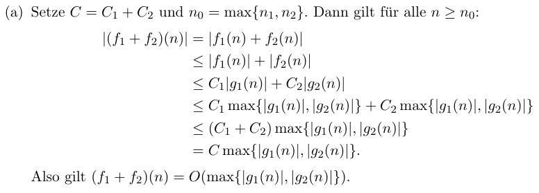
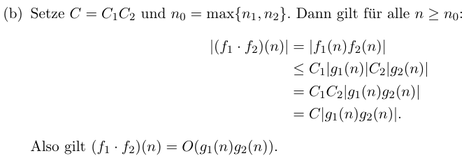

alias:: Laufzeit-von-Funktionen, Landau-Symbole

reference:: AuD 3.7

- reference:: DiMa 1.6
-
- *Landau Symbole*
  collapsed:: true
	- Analyse des Wachstumsverhaltens von Funktionen
	- $f:\mathbb{N}\rightarrow\mathbb{R}$
	- Wichtig ist das Verhalten für "große" n
-
- **Big-O-Notation**
  collapsed:: true
	- reference:: AuD 3.10
	- O für obere Schranke
	- $f,g:\mathbb{N}\rightarrow\mathbb{R}$
	- $O(g(n))=O(g)=\lbrace f:\mathbb{N}\rightarrow\mathbb{R}\rbrace;\exists C>0$ und $\exists u_0\in\mathbb{N}$, sodass $\forall u\geq n_0:|f(n)|=C|g(n)|$
		- |f| > C|g| bei n < n0, aber |f| < C|g| bei n > n0
	- $f\in O(g):\Leftrightarrow\exists c\in\mathbb{R_{>0}}:\exists n_0\in\mathbb{N_{>0}}:\forall n\in\mathbb{N_{\geq n0}}:0\leq f(n)\leq cg(n)$
	  collapsed:: true
		- $2n^2-1\in O(n^2)$
		- $2n^2-1\in O(n^3)$
		- $n\log n\in O(n^2)$
	- O(g) ist die Menge aller Funktionen f, die asymptotisch durch c|g| nach oben beschränkt sind
	- O(g) ist eine Menge von Funktionen: $f\in O(g)$ (oder auch $f=O(g)$) = "f ist in O von g"
	- Beispiel
	  collapsed:: true
		- $f(n)=4n^3+3n^2+2n+1=O(n^3)$
		- Damit: c=10, n0=1 gilt: $\forall n\in\mathbb{N}:|f(n)|=4n^3+3n^2+2n+1\leq4n^3+3n^3+2n^3+1n^3=10n^3$
		- Ist f(n) ein Polynom in n vom Grad d, so gilt $f\in Q(n^{d})$
		- ---
		- $f(n)=n^2,g(n)=n$
		- Dann: $g\in O(f)$, aber $f\notin O(g)$
	- $f_1,f_2,f_3,f_4:\mathbb{N}\rightarrow\mathbb{R}$
	- $f_1\in O(g_1),f_2\in O(g_2)$
	- dann gilt
	  collapsed:: true
		- reference:: 1.59
		- $(f_1+f_2)\in O(max\lbrace g_1,g_2\rbrace)$
		  logseq.order-list-type:: number
			- $\forall n\geq n_1:\exists C_1>0,n_1\in\mathbb{N}:|f_1(n)|\in C_1|g_1(n)|$
			- {:height 180, :width 455}
		- $(f_1\cdot f_2)\in O(g_1\cdot g_2)$
		  logseq.order-list-type:: number
			- $\forall n\geq n_2:\exists C_2>0,n_2\in\mathbb{N}:|f_2(n)|\in C_2|g_2(n)|$
			- {:height 177, :width 459}
	- *Reihenfolge von Funktionen*
	  collapsed:: true
		- Seien $\varepsilon$>0, c>1 Konstanten
		- $c,log(n),n^{\varepsilon},c^{n},n!,n^{n}$
			- konstantes, logarithmisches, polynormielles, exponentielles Wachstum
			- jede diese Funktionen wächst höchstenz so schnell, wie die rechts von ihn stehende
-
- *klein-o-Notation*
  collapsed:: true
	- $$o\left(f\right)=O\left(f\right)\backslash\Theta\left(f\right)$$
	- Beispiele
	  collapsed:: true
		- $$n^2\in O\left(n^3\right),n^2\in o\left(n^3\right);n^2\notin o\left(n^2\right)$$
		- $$2^{n}\in o\left(n^3\right)$$
		- $$\forall a,b\in\mathbb{R}^{+}:\log n\in o\left(n\right);\log^{a}\left(n\right)\in o\left(n^{b}\right)$$
-
- **Big-Omega**
  collapsed:: true
	- reference:: DiMa 1.61
	- reference:: AuD 3.11
	- $f,g:\mathbb{N}\rightarrow\mathbb{Q}$
	- $\Omega(g)=\lbrace f:\mathbb{N}\rightarrow\mathbb{R}|\exists C>0\land\exists n_0\in\mathbb{N}:\forall n\geq n_0:f(n)\geq C|g(n)|\rbrace$
	- $f\in\Omega(g):\Leftrightarrow$ Es gibt positive Konstanten $C,n_0$ mit $0\leq Cg(n)\leq f(n)$ für $n\geq n_0$
	  collapsed:: true
		- $2n^2-1\in\Omega(n^2)$
		- $n^2\leq2n^2-1$ für $n\geq1$
		- $2n^2-1\in\Omega(n\log n)$
	- $\Omega(g)$ ist die Menge aller Funktionen, die asymptotisch durch ein Vielfaches von g(n) nach unten beschränkt ist
	- $f\in\Omega(g)$ oder $f=\Omega(g)$
	- $f\in O(g)\Leftrightarrow g\in\Omega(f)$ ($|f(n)|\in C|g(n)|\Leftrightarrow|g(n)|\geq C^{\prime}|f(n)|$)
-
- **Theta-Notation**
  collapsed:: true
	- reference:: DiMa 1.63
	- reference:: AuD 3.9
	- $f,g:\mathbb{N}\rightarrow\mathbb{R}$
	- $\Theta(g)=\lbrace f:\mathbb{N}\rightarrow\mathbb{R}|\exists C_1,C_2>0\land\exists n_0\in\mathbb{N}:\forall n\geq n_0:C_1|g(n)|\leq|f(n)|\leq C_2|g(n)|\rbrace$
	- $f\in\Theta(g):\Leftrightarrow\exists c_1,c_2\in\mathbb{R_{>0}}:\exists n_0\in\mathbb{N_{>0}}:\forall n\in\mathbb{N_{\geq n0}}:0\leq c_1g(n)\leq f(n)\leq c_2g(n)$
	- Beispiel
	  collapsed:: true
		- $2n^2-1\in\Theta(n^2)$
		- $\forall n\geq n_0:n^2\leq2n^2-1\leq2n^2$
		- $\frac{n^3}{1000}+n^2+n\log n\in\Theta(n^3)$
		- $\frac{1}{1000}n^3\leq\frac{n^3}{1000}+n^2+n\log n\leq\frac{3}{1000}n^3$ für $n\geq1000$
-
- Eigenschaften
  collapsed:: true
	- reference:: AuD 3.12
	- $f,g:\mathbb{N}\rightarrow\mathbb{R}$
	- $f\in\Theta(g)\Leftrightarrow g\in\Theta(f)$
	- $f\in\Theta(g)\Leftrightarrow f\in O(g)\land f\in\Omega(g)$
	- $f\in O(g)\Leftrightarrow g\in\Omega(f)$
-
- Idealerweise wird für eine Funktion f eine möglichst einfache Funktion g mit $f\in O(g)$ (oder wenn notwendig $f\in\Omega(g)$) erzeugt
-
- $$O\left(1\right)\leq O\left(\log n\right)\leq O\left(n\right)\leq O\left(n\cdot\log n\right)\leq O\left(n^2\right)\leq O\left(n^{\log n}\right)\leq O\left(2^{n}\right)\leq O\left(3^{n}\right)\leq O\left(n!\right)$$
-