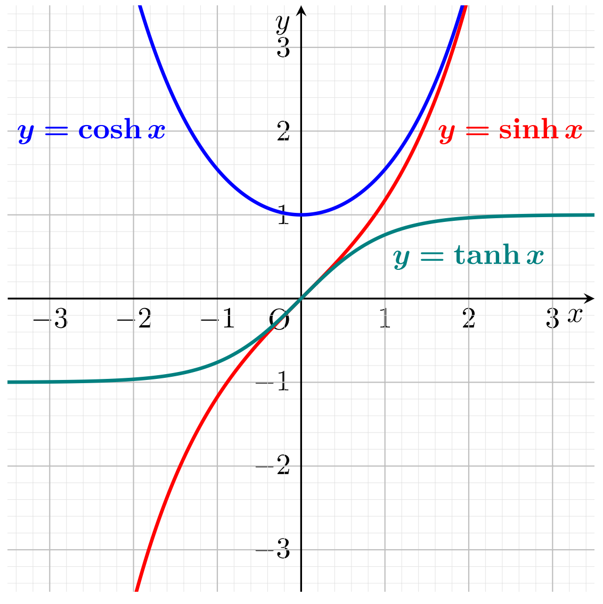

- $$\cosh:\mathbb{C}_{}\rightarrow\mathbb{C}_{},z\mapsto\frac12\left(e^{z}+e^{-z}\right),\sinh\mathbb{C}_{}\rightarrow\mathbb{C}_{},z\mapsto\frac12\left(e^{z}-e^{-z}\right)$$
- "cosinus hyperbolicus", "sinus hyperbolicus"
- 
-