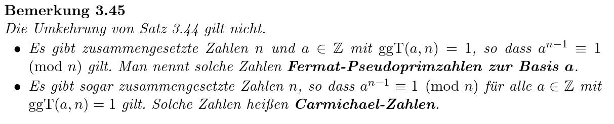

reference:: 3.44

- reference:: Algebra 3.5
- sei $a\in\mathbb{Z},p\in\mathbb{P}$, dann gilt
  $$a^{p}\equiv a\bmod p$$
-
- wenn auch $p\nmid a$ gilt (also $\text{ggT}\left(n,p\right)=1$), dann
  $$a^{p-1}\equiv1\bmod p$$
	- (auch $n^{p-1}\%p=1$)
-
- Bemerkung
	- {:height 167, :width 771}
-